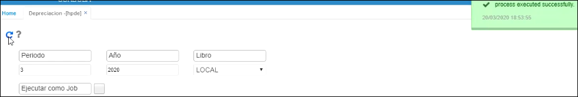
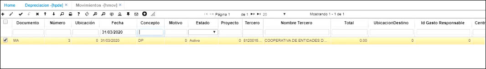

# Depreciación - HPDE  

Esta aplicación permite generar la depreciación automática de los activos fijos desde OASISCOM.  

**Periodo:**  Se selecciona el periodo para el que se va a generar la depreciación  
**Año:**  Se selecciona el año  
**Libro:**  Se selecciona la opción Local

Finalmente se ejecuta el proceso  

  

Posterior a esto, el sistema nos va a crear un movimiento en la aplicación [HMOV](http://docs.oasiscom.com/Operacion/erp/activos/hmovimient/hmov#Movimiento-de-Depreciación-de-un-Activo-fijo  

  

**Documento:**  MA, que corresponde a Movimientos de activos fijos  
**Fecha:**  La depreciación se va a crear con la fecha del último día del mes  
**Concepto:** DP, que corresponde a depreciación  

En la parte inferior, en la pestaña detalle, nos va a traer cada uno de los activos fijos que se deben depreciar al mes de marzo (en este ejemplo), con su respectiva cuota.  Se debe realizar validación y posteriormente, procesar el documento.  

    
  

Una vez procesado, se revisa la contabilización en la pestaña Contabilización.   

  

En la parte derecha se puede filtrar el activo fijo  

  

Verificamos que acreditó a la cuenta de depreciación y debitó a la cuenta del gasto

  

Posteriormente, ingresamos a la aplicación **HSSP* de Saldos de activos y filtramos el activo que deseamos consultar y el sistema nos muestra el valor por el cual se generó la depreciación por medio de un documento MA número 3.  Al finalizar, el sistema nos va a indicar que se generó 1 mes de depreciación y por lo tanto, nos quedan 59 meses por depreciar (en el ejemplo)  

