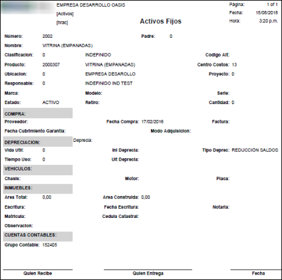

# HRAC - Activos Fijos

El reporte **HRAC** permite ver un resumen con las características del activo fijo consultado, es decir, permite ver la hoja de vida del activo fijo.  Recordemos que la hoja de vida se debe registrar en la aplicación **HACT - Activos**. Este puede ser exportado en formato PDF, Word o Excel.  

Ingresamos a la aplicación HRAC y consultamos por el libro contable en donde se encuentre registrado el activo fijo (Libro local 0 - Libro IFRS 1) y el número de identificación de este. Este número ha sido asignado previamente cuando se registró en la aplicación [**HACT - Activos**](http://docs.oasiscom.com/Operacion/erp/activos/hbasica/hact). Damos clic en el botón _Generar_ .  

Arrojará un reporte como el siguiente:  

Al exportarlo en formato PDF.  

  

De esta forma, se puede visualizar toda la hoja de vida, se puede imprimir y se puede ver la firma de quién recibe el activo, quién lo entrega y la fecha de entrega.  
