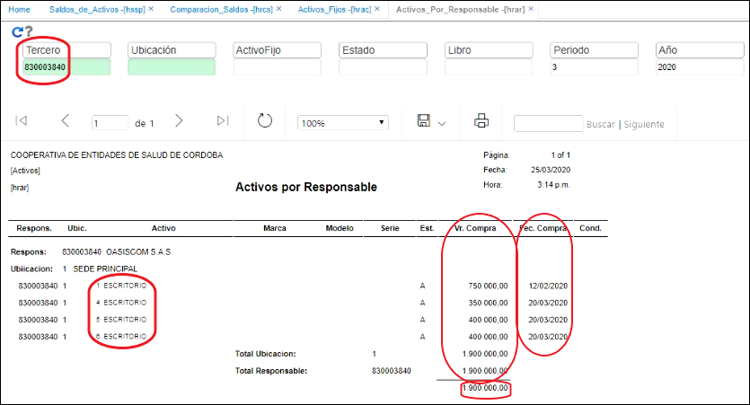

# Activos por responsable - HRAR  

En este reporte, se pueden visualizar los activos que tiene cada persona a cargo.  Para esto, se consulta un tercero y la pantalla nos muestra ese tercero qué activos tiene asignados, cuál es el valor de compra de cada uno de los activos, cuál es la fecha de compra de cada uno de los activos y en general, de cuánto es responsable esa persona en específico.  

  

