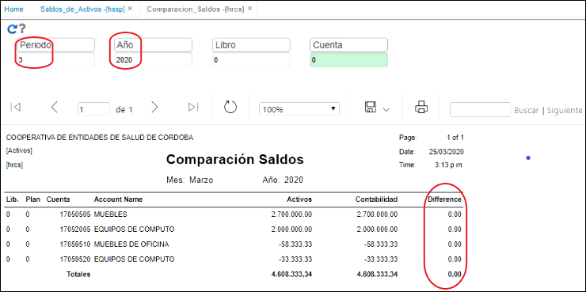

# Comparación de Saldos - HRCS  

Este reporte nos muestra la comparación de saldos entre la contabilidad y los activos fijos.  Se puede comparar a un año y un periodo determinados.  Este reporte se debe estar revisando periódicamente para verificar que no se presenten diferencias con la contabilidad.  Las diferencias podrían presentarse porque en la aplicación bcue, se desmarcan las cuentas contables con el módulo de activos fijos.  

  

