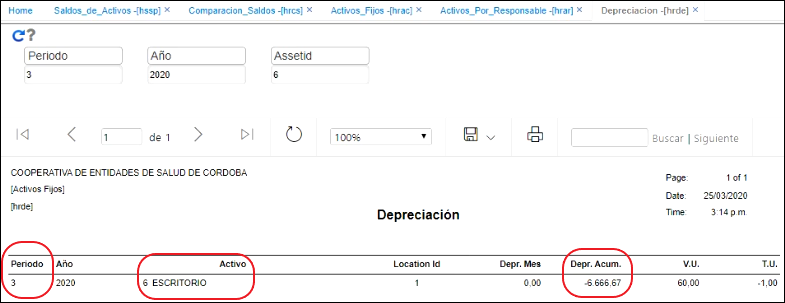

# [**HRDE - Depreciación**](http://docs.oasiscom.com/Operacion/erp/activos/hreporte/hrde)

En este reporte se puede visualizar la depreciación del activo fijo.  Para esto, se consulta un activo en específico o se puede dejar el campo **_AssetId_** (identificación del activo) vacío para consultar todos los activos.  Este reporte nos va a mostrar en el periodo consultado, cual fue el valor de la depreciación del o de los activos fijos.  

  

