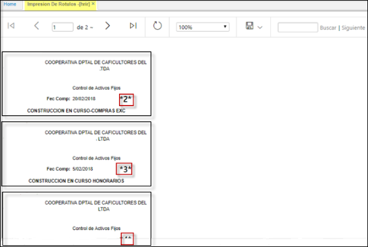

# [**HRIR - Impresión de Rótulos**](http://docs.oasiscom.com/Operacion/erp/activos/hreporte/hrir)

Reporte que permite la generación de rótulos de impresión de activos fijos.  
Se establecen como filtros las fechas inicial y final de la compra del activo y el campo Asset (Activo) número o consecutivo.  
Esta aplicación **HRIR** le permite imprimir los rótulos para cada activo fijo, de acuerdo con la organización y clasificación que se haya asignado en la aplicación activos **[HACT]** hoja de vida del activo.  

  

Arrojará un reporte como el siguiente:  

  

**Puede ser exportarlo en formato: PDF, Excel, Word.**  

********
