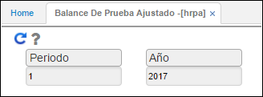
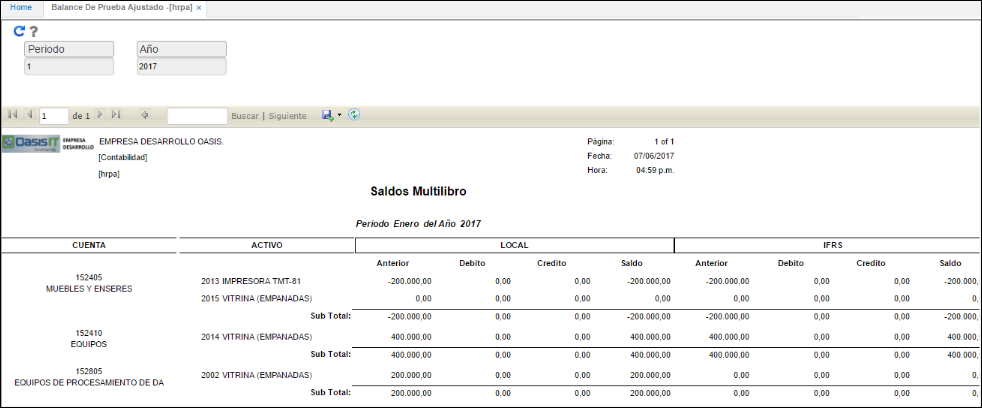
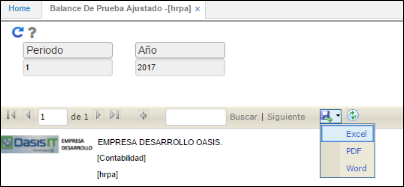

# HRPA - Balance de Prueba Ajustado

La aplicación **HRPA** arroja un reporte de saldos en esquema multilibro con la informacion del módulo de activos fijos. Se observará la información tanto para Libro Local como para IFRS y las diferencias encontradas.  

Se realiza el filtro por periodo y año.  

Ingresados los datos damos click en el botón _Generar_  y el sistema arrojará el reporte correspondiente.  

OasisCom permite descargar el reporte en formatos Excel, PDF o Word con el fin de facilitar su análisis.  

