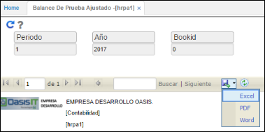

# Balance de Prueba Ajustado - HRPA1

La aplicación **HRPA1** arroja un reporte de saldos de diferencia entre el esquema del Libro Local, las Diferencias e IFRS con la información del módulo de activos fijos.

Se realiza el filtro por periodo, año y libro.  

Ingresados los datos damos clic en el botón _Generar_  y el sistema arrojará el reporte correspondiente.  

OasisCom permite descargar el reporte en formatos Excel, PDF o Word con el fin de facilitar su análisis.  

