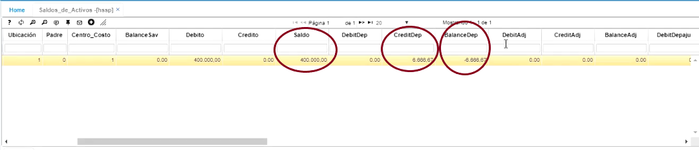
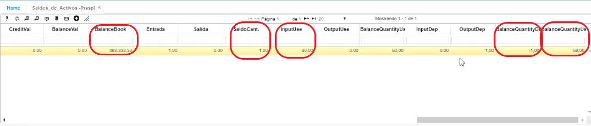
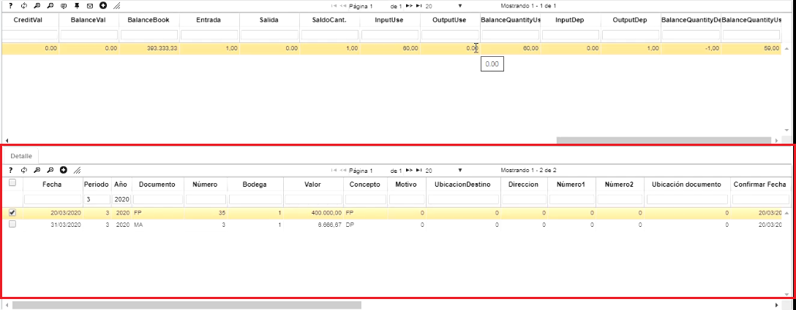
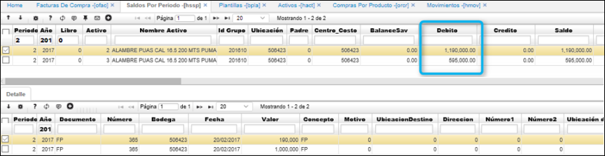
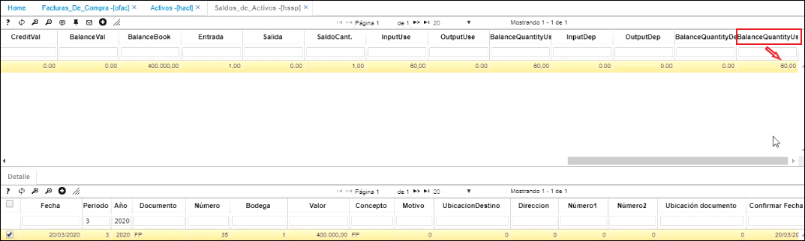
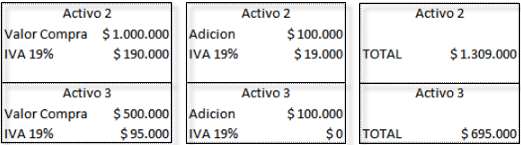
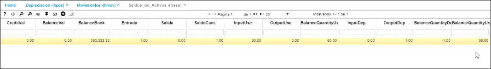

# [**Saldos de Activos - HSSP**](http://docs.oasiscom.com/Operacion/erp/activos/hsaldo/hssp#saldos-de-activos-hssp)  

En esta aplicación, se pueden revisar los saldos de los activos fijos, tanto de los activos fijos que fueron ingresados por la aplicación **OFAC - Facturas de compra**, como de los ingresados por **HMOV - Movimientos**  
 
 * [**Verificación de saldos de activos fijos ingresados por OFAC - Facturas de compra**](http://docs.oasiscom.com/Operacion/erp/activos/hsaldo/hssp#verificacion-de-saldos-de-activos-fijos-ingresados-por-ofac---facturas-de-compra)  

* [**Verificación de saldos de activos fijos ingresados por HMOV**](http://docs.oasiscom.com/Operacion/erp/activos/hsaldo/hssp#verificación-de-saldos-de-activos-fijos-ingresados-por-hmov)  

* [**Saldos de Depreciación**](http://docs.oasiscom.com/Operacion/erp/activos/hsaldo/hssp#saldos-de-depreciación)  

####  **Maestro**

Para consultar los saldos de un activo fijo en específico se filtra el número del activo por el campo **_Activo_** y damos enter. 

En la aplicación vamos a poder identificar cuál es el costo histórico del activo fijo consultado por medio del campo **_Débito_**, el valor de la depreciación ejecutada por el mes consultado en el campo **_CrediDep_**, el valor de la depreciación acumulada a la fecha en la que se consulta en el campo **_BalanceDep_**, el saldo en libros en el campo **_BalanceBook_**, es decir, el saldo histórico menos la depreciación acumulada. También en el campo **_SaldoCant_** conocer las unidades del activo fijo, la vida útil de este en el campo **_InputUse_** y por último cúantos meses se han depreciado y cuátos meses quedan por depreciar en los campo **_BalanceQuantityDep_** y **_BalanceQuantityUse_** respectivamente. Entre otros datos.  

  
 

####  **Detalle** 

En la parte del detalle, el sistema nos indica los documentos que soportan el saldo consultado.  

  

En esta aplicación se pueden realizar las siguientes consultas:  

#### [**Verificación de saldos de activos fijos ingresados por OFAC - Facturas de compra**](http://docs.oasiscom.com/Operacion/erp/activos/hsaldo/hssp#verificacion-de-saldos-de-activos-fijos-ingresados-por-ofac---facturas-de-compra)
  
Realizado con anterioridad el movimiento de ingreso de Activo Fijo por Compras en la aplicación [**OFAC - Facturas de Compras**](http://docs.oasiscom.com/Operacion/scm/compras/ofactura/ofac) y luego de haber llenado la hoja de vida del activo fijo en la aplicación [**HACT - Activos**](http://docs.oasiscom.com/Operacion/erp/activos/hbasica/hact), consultamos los activos en la aplicación HSSP y veremos que estos se encuentran valorizados por el Costo + IVA.  

En el campo llamado _Balance Quantity Use Book_, dice cuántos meses le quedan pendientes al activo por depreciar.  

  

#### [Verificación de saldos de activos fijos ingresados por HMOV - Movimientos](http://docs.oasiscom.com/Operacion/erp/activos/hsaldo/hssp#verificación-de-saldos-de-activos-fijos-ingresados-por-hmov---movimientos)

Realizado con anterioridad el movimiento de ingreso de Activo Fijo por HMOV en la aplicación [**HMOV - Movimientos**](http://docs.oasiscom.com/Operacion/erp/activos/hmovimient/hmov#manejo-de-iva-en-activos-fijos), consultamos los activos en la aplicación HSSP y veremos que estos se vieron aumentados en las cifras correspondientes al movimiento.

  

### [**Saldos de Depreciación**](http://docs.oasiscom.com/Operacion/erp/activos/hsaldo/hssp#saldos-de-depreciación)  

Después de verificados en la contabilización del [**HMOV - Movimientos**](http://docs.oasiscom.com/Operacion/erp/activos/hmovimient/hmov#movimiento-de-depreciaci%C3%B3n-de-un-activo-fijo) la acreditación y debitación del movimiento que creamos de un activo fijo, filtramos el activo que deseamos consultar y el sistema nos muestra el valor por el cual se generó la depreciación por medio de un documento MA número 3.  Al finalizar, el sistema nos va a indicar que se generó 1 mes de depreciación y por lo tanto, nos quedan 59 meses por depreciar (en el ejemplo)  

