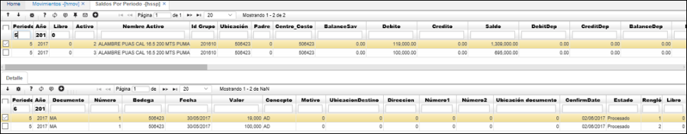

# Saldos de Activos - HSSP

## [Ingreso de Activo Fijo por Compras OFAC](http://docs.oasiscom.com/Operacion/erp/activos/hsaldo/hssp#ingreso-de-activo-fijo-por-compras-OFAC)

Realizado anteriormente  el movimiento de ingreso de Activo Fijo por Compras en la aplicación [**OFAC - Facturas de Compras**](http://docs.oasiscom.com/Operacion/scm/compras/ofactura/ofac#manejo-de-iva-en-activos-fijos), consultamos los activos en la aplicación HSSP y veremos que estos se encuentran valorizados por el Costo + IVA.

## [Ingreso de Activo Fijo por HMOV](http://docs.oasiscom.com/Operacion/erp/activos/hsaldo/hssp#ingreso-de-activo-fijo-por-HMOV)

Realizado anteriormente  el movimiento de ingreso de Activo Fijo por HMOV en la aplicación [**HMOV - Movimientos**](http://docs.oasiscom.com/Operacion/erp/activos/hmovimient/hmov#manejo-de-iva-en-activos-fijos), consultamos los activos en la aplicación HSSP y veremos que estos se vieron aumentados en las cifras correspondientes al movimiento.

