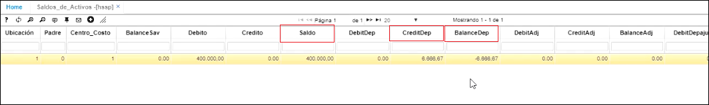
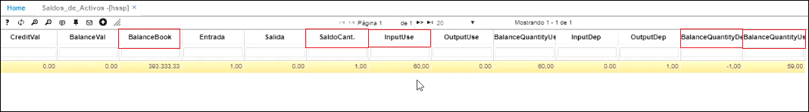
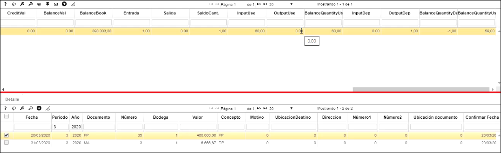

# [**Saldos de Activos - HSSP**](http://docs.oasiscom.com/Operacion/erp/activos/hsaldo/hssp#saldos-de-activos-hssp)  

En esta aplicación, se pueden revisar los saldos de los activos fijos, tanto de los activos fijos que fueron ingresados por la aplicación **OFAC - Facturas de compra**, como de los ingresados por **HMOV - Movimientos**
 
 
* [**Verificación de saldos de activos fijos que han sido ingresados por la aplicación OFAC - Facturas de compra**](http://docs.oasiscom.com/Operacion/erp/activos/hsaldo/hssp#verificacion-de-saldos-de-activos-fijos-que-han-sido-ingresados-por-la-aplicación-ofac-facturas-de-compra)  
* [**Verificación de saldos de activos fijos que han sido ingresados por la aplicación HMOV - Movimientos**](http://docs.oasiscom.com/Operacion/erp/activos/hsaldo/hssp#Verificación-de-saldos-de-activos-fijos-que-han-sido-ingresados-por-la-aplicación-HMOV-Movimientos)  
* [**Saldos de la depreciación**](http://docs.oasiscom.com/Operacion/erp/activos/hsaldo/hssp#saldos-de-la-depreciacion)
 

####  **Maestro**

**Periodo:**  Periodo del que queremos ver el saldo del activo  
**Año:**  Año del que se quiere ver el saldo del activo    
**Libro:**  0(cero)  
**Activo:** El código del activo del cual queremos ver el saldo  
**Nombre activo:**  el nombre del activo ligado al código del anterior campo  
**Débito:** Costo histórico del activo fijo  
**CreditDep:**  Depreciación ejecutada en el mes que se consulta  
**BalanceDep:** Depreciación acumulada a la fecha de la consulta  
**BalanceBook:** Saldo en libros, o sea, costo histórico menos la depreciación acumulada  
**SaldoCant.:**  Unidades que hay del activo fijo  
**InputUse:** Vida útil del activo fijo  
**BalanceQuantityDep:** Cuántos meses se ha depreciado el activo fijo  
**BalanceQuantityUseBook:** Cuántos meses le quedan pendientes por depreciar al activo fijo  

  
 

####  **Detalle** 

En la parte del detalle, el sistema nos indica los documentos que soportan el saldo consultado  

  

En esta aplicación puedes realizar los siguientes movimientos:

#### [**Verificación de saldos de activos fijos que han sido ingresados por la aplicación OFAC - Facturas de compra**](http://docs.oasiscom.com/Operacion/erp/activos/hsaldo/hssp#Verificación-de-saldos-de-activos-fijos-que-han-sido-ingresados-por-la-aplicación-OFAC-Facturas-de-compra)
  
Realizado con anterioridad el movimiento de ingreso de Activo Fijo por Compras en la aplicación [**OFAC - Facturas de Compras**](http://docs.oasiscom.com/Operacion/scm/compras/ofactura/ofac) y luego de haber llenado la hoja de vida del activo fijo en la aplicación [**HACT - Activos**](http://docs.oasiscom.com/Operacion/erp/activos/hbasica/hact), consultamos los activos en la aplicación HSSP y veremos que estos se encuentran valorizados por el Costo + IVA.

En el campo llamado _Balance Quantity Use Book_, dice cuántos meses le quedan pendientes al activo por depreciar  

  

#### [Verificación de saldos de activos fijos que han sido ingresados por la aplicación HMOV - Movimientos](http://docs.oasiscom.com/Operacion/erp/activos/hsaldo/hssp#verificacion-de-saldos-de-activos-fijos-que-han-sido-ingresados-por-la aplicacion-hmov-movimientos)

Realizado con anterioridad el movimiento de ingreso de Activo Fijo por HMOV en la aplicación [**HMOV - Movimientos**](http://docs.oasiscom.com/Operacion/erp/activos/hmovimient/hmov#manejo-de-iva-en-activos-fijos), consultamos los activos en la aplicación HSSP y veremos que estos se vieron aumentados en las cifras correspondientes al movimiento.

  

### [**Saldos de la depreciación**](http://docs.oasiscom.com/Operacion/erp/activos/hsaldo/hssp#saldos-de-la-depreciacion)  

Después de verificados en la contabilización del [**HMOV - Movimientos**](http://docs.oasiscom.com/Operacion/erp/activos/hmovimient/hmov#movimiento-de-depreciaci%C3%B3n-de-un-activo-fijo) la acreditación y debitación del movimiento que creamos de un activo fijo, filtramos el activo que deseamos consultar y el sistema nos muestra el valor por el cual se generó la depreciación por medio de un documento MA número 3.  Al finalizar, el sistema nos va a indicar que se generó 1 mes de depreciación y por lo tanto, nos quedan 59 meses por depreciar (en el ejemplo)  

