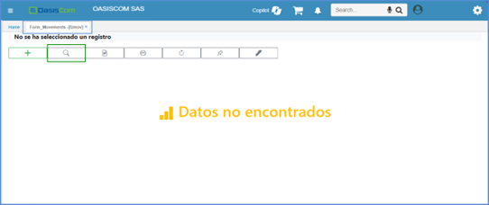
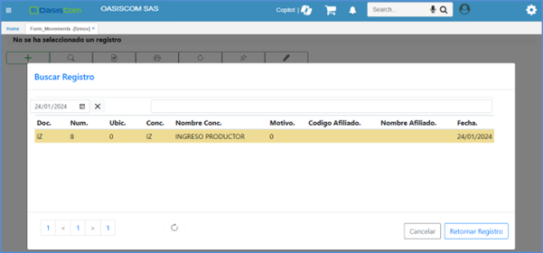
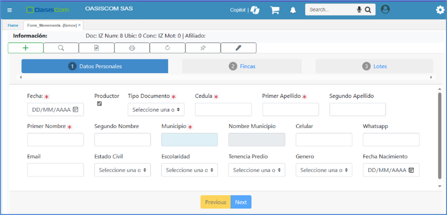
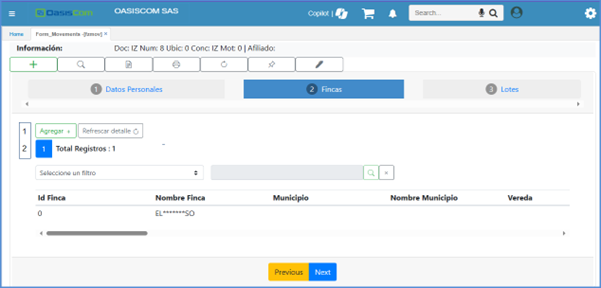
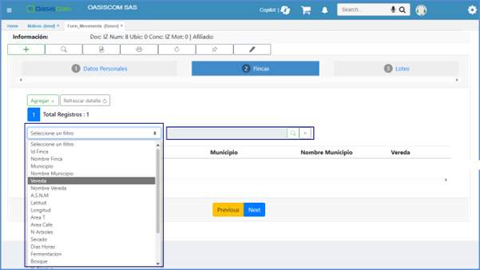
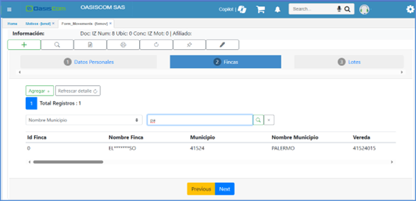
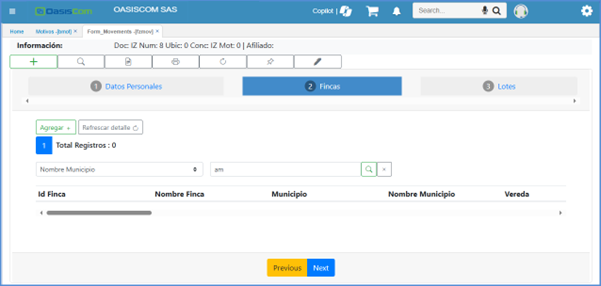

#  Asociados

El módulo de asociados del sistema de información OASIS está orientado a satisfacer los requerimientos de información de aquellas empresas que incluyen entre sus objetivos la captación y la colocación de recursos financieros a través de sus asociados, tales como cooperativas, fondos de empleados, entidades financieras, asociaciones de ahorro y demás similares. 

Este módulo comprende los siguientes submódulos:

* [**Datos Basicos**](http://docs.oasiscom.com/Operacion/erp/asociados/zbasica/)  
* [**Saldos de Asociados**](http://docs.oasiscom.com/Operacion/erp/asociados/zsaldo/)  
* [**Movimientos de Asociados**](http://docs.oasiscom.com/Operacion/erp/asociados/zmovimient/)  
* [**Procesos Especiales**](http://docs.oasiscom.com/Operacion/erp/asociados/zproceso/)  
* [**Reportes**](http://docs.oasiscom.com/Operacion/erp/asociados/zreporte/)  
* [**Aportes**](#aportes)
* [**Préstamos**](#préstamos) 
* [**FZMOV Formulario de asociados**](#fzmov-formulario-de-asociados)

Su objetivo principal es el control de los aportes hechos por los asociados y de los préstamos hechos a estos mismos. Este objetivo se logra manteniendo en línea los estados de cuenta, que son afectados por los diferentes movimientos originados en el propio módulo o en los demás subsistemas. La característica principal del módulo es que los aportes y los préstamos están en cabeza del asociado y por tanto es posible realizar en cualquier momento las consultas comparativas para tomar decisiones en cuanto a la aprobación de los préstamos y sus características. 

Los asociados se definen como los terceros de la empresa, permitiendo incluir a empleados, clientes y personas sin relación con la empresa. Dentro de la ficha social permite incluir los atributos necesarios y que dependen de la naturaleza de la empresa, tales como los datos personales, comerciales y laborales. Así mismo permite establecer la dirección de entrega de los estados de cuenta de los aportes y préstamos.

Presenta la parametrización necesaria para establecer los diferentes conceptos de movimientos y la ejecución de las operaciones propias del módulo, tales como intereses y dividendos. La definición de estos conceptos hace especial énfasis en la comunicación que debe establecerse con el módulo de contabilidad en cuanto a la generación del comprobante como al cuadre de los diferentes auxiliares.
El sistema genera automáticamente el comprobante de contabilidad en estado pendiente por confirmar, el cual es verificado y procesado en el módulo contable.

Una característica adicional del módulo es la interfaz que tiene con el módulo de Tesorería, el cual opera como el control de caja permitiendo afectar los auxiliares de asociados en línea por movimientos tales como Aportes, Retiro de Aportes, Desembolso de Préstamos y Pago de Préstamos.

En las empresas cuyos asociados son los empleados, tales como fondos de empleados y cooperativas es posible tener relación directa con el módulo de nómina, a través del cual se efectúan los descuentos correspondientes a los préstamos que hace el fondo y de la misma forma se recauda lo correspondiente a los aportes periódicos de cada uno de los asociados.

En las entidades donde se encuentra el  módulo de cuentas de ahorro o cuentas corrientes, el sistema permite realizar los pagos a los préstamos afectando la cuenta que el asociado autorice para la cancelación de su crédito. Esta operación permite el pago de grandes volúmenes de créditos sin mayores operaciones involucradas. 

Como se ha mencionado, el módulo de asociados tiene interfaz con varios subsistemas, pero esto no indica que deba instalarse en compañía de estos necesariamente. El módulo es totalmente autónomo y permite su operación realizando todas las operaciones desde el propio módulo. Así mismo contiene una lectura de interfaz para permitir la carga masiva de aportes y pagos generados por otro sistema desde archivos planos.

## [Aportes](#aportes)

Permite la consulta de los estados de cuenta de los aportes de los asociados. Este estado de cuenta se encuentra en línea y es afectado por cada uno de los movimientos realizados en el módulo y los generados en los demás módulos.
Mantiene un registro de los saldos periódicos de los aportes, necesarios para la generación de los estados de cuenta y para el cuadre con el auxiliar de contabilidad. Permite observar en línea los movimientos que afectaron cada una de los saldos de los aportes.
Permite generar e imprimir los estados de cuenta individualmente o en forma masiva para ser enviados a los asociados periódicamente.

## [Préstamos](#préstamos)

Permite la inclusión de las solicitudes de préstamos y su aprobación. En el momento de la aprobación se genera un comprobante de egreso pendiente por confirmar. En el momento de la confirmación del egreso o el desembolso se afecta el estado de cuenta del asociado y se crea el plan de amortización de la obligación de acuerdo a los parámetros establecidos tales como:
-	Tipos de Cuota : Fija, en la cual se mantiene la cuota fija a través de todos los periodos de pago o Variable, en la cual la cuota va disminuyendo a medida que se va cancelando el préstamo ya que los intereses se calculan sobre el saldo insoluto de la deuda y el abono a capital es constante.
-	Cobro de Intereses : Anticipado, si los intereses del primer mes se descuentan en el desembolso del crédito y así en sucesivo en las cuotas por adelantado o Vencido, en la cual los intereses se cobran al final del periodo de la cuota.
-	Número de Cuotas: establece la cantidad de cuotas en las cuales se cancelará el préstamo
-	Periodo de Cobro: El periodo de cobro de cuota: Semanal, Quincenal, Mensual, Trimestral, Semestral
-	Interés Corriente: Porcentaje efectivo de interés a cobrar por el préstamo
-	Interés de Mora: Porcentaje de interés de mora en caso de atraso en el pago de las cuotas
-	Forma de Pago: Efectivo por abono en caja en tesorería, Automático por descuento a cuenta de ahorro, automático por descuento de nómina.
-	Seguro: Valor del seguro cobrado 
Permite imprimir el plan de amortización del préstamo.
Permite la consulta de los préstamos pendientes en línea, con los abonos hechos históricamente. Así mismo conserva los saldos periódicos de los préstamos para la elaboración de los estados de cuenta y para la conciliación con los auxiliares de contabilidad.
Permite generar los estados de cuenta o cuentas de cobro recordatorias para cada uno de los asociados, incluyendo la información del préstamo.

## [**FZMOV Formulario de asociados**](#fzmov-formulario-de-asociados)

Es un programa que permite crear y modificar información de asociados en una presentación tipo formulario  
	 
Se ingresa a la aplicación **FZMOV – Formulario de Asociados**
 
Botones a visualizar en la aplicación.

 

Guardar información y continua a la siguiente pestaña. 

 

Botón para finalizar el proceso.

 

Crear Asociado: Se visualiza el formulario con datos básicos para crear consulta.

 

Buscar Asociados: Busca consultas en estado Activo.

 

Visualización de Formato: Muestra el formato de manera grafica.

 

Impresión: Genera ventana de impresión del navegador.

 

Refrescar formulario: Recarga formulario en caso de realizar modificaciones en la parametrización.

 

Adjuntos: Muestra ventana para poder adjuntas archivos.

 

Modificar consulta: Ventana con formulario para poder editar datos del encabezado de la consulta.

 

Firma: Ventana de escritura para realizar un firmado digital.

 

>**Nota:** El cambio de pestañas sin ejecutar el botón NEXT es permitido, pero se debe tener en cuenta que para guardar la información diligenciada es necesario ejecutar el botón de **Next** o **Previous**.  

Para este proceso se usa el siguiente ejemplo:

Una vez seleccionado el registro, la informacion será diligenciada en el formulario y en sus correspondientes pestañas

En la sección Finca, se puede visualizar dos secciones nuevas, las cuales son: 
1. Botones de página con total de registros.
2. Sección de filtrado de registros. 

En la sección de filtro se mostrará una lista con los campos, según la configuración que se encuentra en el  [**BMOT - Motivos**](https://docs.oasiscom.com/Operacion/common/bsistema/bmot).

En el filtro estará deshabilitado hasta que se seleccione una opción de la lista. Se realiza la búsqueda con los datos mostrados en la tabla.

**Ejemplo:** Nombre municipio:  se puede escribir algunas letras donde al momento de filtrar se mostrará los datos que coincidan con lo esperado.

  Si el filtro realizado no genera algún resultado la tabla se visualizará en blanco.

  

  Importante tener en cuenta que solo funciona con texto, ya que, si quiere consultar con los números, deben ser específicos y exactos.

>**Nota:** 	El máximo por página es de 5 registros, ya que evita perder el encabezado de la tabla. 
Tener en cuenta que, al cambiar de pestañas, los filtros se reestablecen. 
