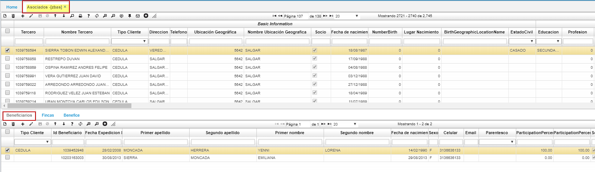

# ASOCIADOS - ZBAS

Los asociados **[ZBAS]** se definen como los terceros de la empresa, permitiendo incluir a empleados, clientes y personas sin relación con la empresa. Dentro de la ficha social permite incluir los atributos necesarios y que dependen de la naturaleza de la empresa, tales como los datos personales, comerciales y laborales. Así mismo permite establecer las dirección de entrega de los estados de cuenta de los aportes y préstamos.  

  

El campo 'Característica' de la opción **ZBAS** se visualizan sus items en una lista desplegable.  
En el BCRC los siguientes campos.  
* Ventana Maestro: Estado Civil, Casa, Carro, Sexo (Femenino, Masculino y Genérico,) Ocupación, nivel de educación.  
Detalle pestaña Fincas:  
* Características: Tenencia, Tipo de análisis, Beneficiadero, tipo de secado, infraestructura.  

Desde la aplicación **[BTER]** parametrizamos o registramos todos los terceros que podemos tener, para el sistema Oasis la palabra terceros se hace referencia a: empleados, clientes, proveedores, afiliados, vendedores, **asociados**, entre otros. Es decir, todas las personas que interactúan o se relacionan con nuestro negocio.  

