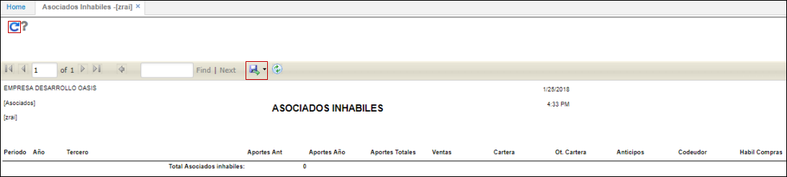

# ZRAI - Asociados Inhábiles

El reporte **ZRAI** permite ver las ventas, cartera y anticipo durante el periodo el cual el asociado se haya consultado.  

Ingresamos a la aplicación y consultamos dando click en el botón . El reporte puede ser extraído en formato de Excel, PDF o Word.  
.
