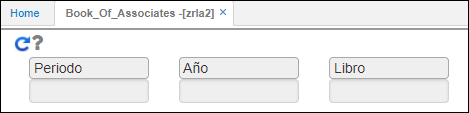

# ZRLA2 - Libro de Asociados

El reporte **ZRLA2** permite ver los ingresos, retiros, aportes ordinarios y etxraordinarios por asociado.  

Ingresamos a la aplicación y consultamos por periodo, año y libro contrable.  

Ingresados los datos damos click en el botón . El reporte puede ser extraído en formato de Excel, PDF o Word.  

