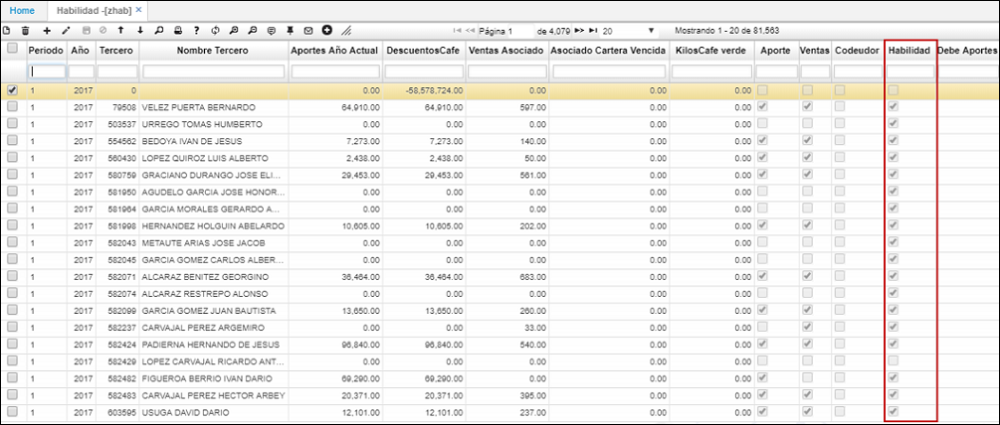

# ZHAB - Habilidad

La aplicación ZHAB refleja los resultados por asociados y las validaciones al haber ejecutado el proceso de la aplicación **WCAL - Calcula Indicadores**.  

Si el proceso de **WCAL** se ejecutó únicamente para un asociado, en el campo _Tercero_ filtramos por el número de identificación, ingresando periodo y año. Si el proceso fue para todos los asociados, nos ubicamos en un campo de consulta y oprimimos Enter.  

La aplicación **ZHAB** traerá la información generada y habilitará automáticamente el flag _Habilidad_ a quienes cumplan con la habilidad de asociado. Además permite el seguimiento del pago de aportes del cliente en un periodo específico por medio de la columna _Pago de Aportes_.  

