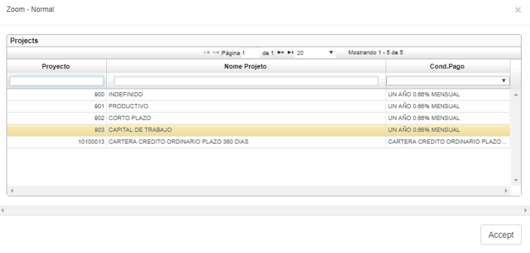
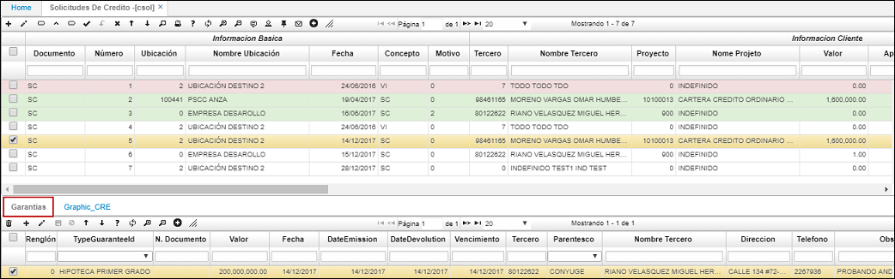
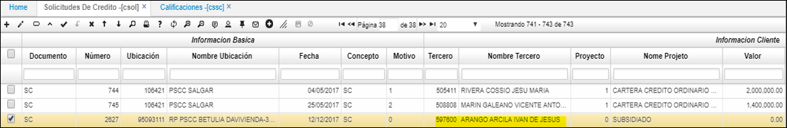
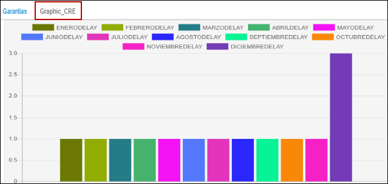

# CSOL - Solicitudes de Créditos

La aplicación CSOL permite realizar solicitudes de crédito y asignar garantías a los mismos.  

Para realizar una solicitud de crédito, ingresamos a la aplicación y creamos un nuevo registro.  

**Documento:** digitar documento SC (solicitud de crédito).  
**Ubicación:** digitar o seleccionar del zoom la ubicación donde se está realizando la solicitud.  
**Fecha:** ingresar la fecha en la cual se realiza la solicitud.  
**Concepto:**  digitar concepto SC (solicitud).  
**Tercero:** ingresar el número de identificación del tercero que solicita el crédito. Dicho tercero debe estar registrado previamente en la aplicación [**BTER - Terceros**](http://docs.oasiscom.com/Operacion/common/btercer/bter).  
**Proyecto:** asignar del zoom la línea de crédito por la cual solicitan el crédito.  

**Valor:** ingresar el valor por el cual fue solicitado el crédito.  
**Aprobado:** ingresar el valor aprobado para el crédito solicitado. Si la aprobación se realiza de manera manual, el usuario debe activar el check _**Aprobar**_ e ingresar el valor del crédito manualmente. Si por el contrario, la aprobación se realiza automáticamente, se debe guardar el formulario del maestro en estado activo y dar click en el botón de la barra de herramientas _Calculo Cupo_, el sistema calculará el cupo disponible para asignarle al tercero que solicita el crédito.  

**Check _Aprobar:_** activar el check en caso de que la aprobación del crédito se realice de manera manual.  
**DocDocumento:** si la solicitud de crédito tiene un pedido asociado, se debe ingresar las siglas del documento (PD) realizado en VPED, en la aplicación CSOL.  
**DocNúmero:** ingresar el número de pedido asginado en VPED.  
**DocUbicación:** ingresar la ubicación del pedido de acuerdo al registro en VPED.  

Al realizar la facturación del pedido, se deberá asociar en el maestro la solicitud del crédito y esta traerá automáticamente en el detalle los productos.  

Ingresados los datos, damos click en el botón _Guardar_ y procedemos a registrar las garantías del crédito en el detalle.  

Finalmente, procesamos la solicitud del crédito dando click en el botón .  

### [Pestaña _Graphic CRE_](http://docs.oasiscom.com/Operacion/erp/cartera/ccredito/csol#pestaña-graphic-cre)

En la pestaña _Graphic CRE_, el usuario podrá ver de manera grafica (Barras), si el tercero seleccionado en el maestro tiene saldo en mora, si el saldo en mora esta al día o si no ha tenido ningun tipo de saldo en mora.  

Ingresamos a la aplicación CSOL y seleccionamos un registro.  

En el detalle, ingresamos a la pestaña _Graphic CRE_ y visualizaremos la gráfica de la siguiente manera:  

En las escalas, el eje Y tiene un rango de 0 a 3 y el eje X nos indica los meses del año.  

En el eje Y:  
* De 0 a 1 indica que el tercero no ha tenido ningun moviento de saldo en mora.  
* De 1 a 2 indica que el tercero está al dia.  
* De 2 a 3 indica que el tercero tiene saldo en mora.  

En el siguiente caso, nos indica que el tercero seleccionado tiene saldo en mora el mes de diciembre y el resto de los meses del año no ha tenido nungun tipo de movimiento.  

