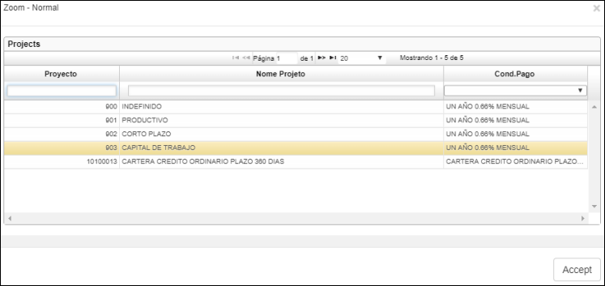
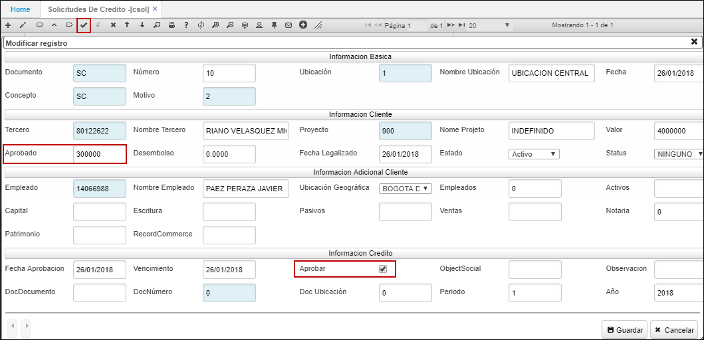
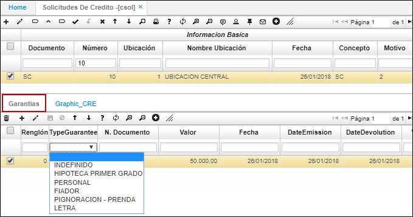
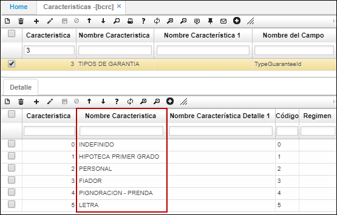

# CSOL - Solicitudes de Créditos

La aplicación CSOL permite realizar solicitudes de crédito y asignar garantías a los mismos.  

Para realizar una solicitud de crédito, ingresamos a la aplicación y creamos un nuevo registro.  

**Documento:** digitar documento SC (solicitud de crédito).  
**Ubicación:** digitar o seleccionar del zoom la ubicación donde se está realizando la solicitud.  
**Fecha:** ingresar la fecha en la cual se realiza la solicitud.  
**Concepto:**  digitar concepto SC (solicitud).  
**Tercero:** ingresar el número de identificación del tercero que solicita el crédito. Dicho tercero debe estar registrado previamente en la aplicación [**BTER - Terceros**](http://docs.oasiscom.com/Operacion/common/btercer/bter).  
**Proyecto:** asignar del zoom la línea de crédito por la cual solicitan el crédito.  

**Valor:** ingresar el valor por el cual fue solicitado el crédito.  
**Aprobado:** ingresar el valor aprobado para el crédito solicitado. Si la aprobación se realiza de manera manual, el usuario debe activar el check _**Aprobar**_ e ingresar el valor del crédito manualmente. Si por el contrario, la aprobación se realiza automáticamente, se debe guardar el formulario del maestro en estado activo y dar click en el botón de la barra de herramientas _Calculo Cupo_, el sistema calculará el cupo disponible para asignarle al tercero que solicita el crédito.  
**Fecha Aprobación:** indicar la fecha de aprobación de la solicitud del crédito.  
**Vencimiento:** indicar la fecha de vencimiento de la solicitud del crédito.  
**Check _Aprobar:_** activar el check en caso de que la aprobación del crédito se realice de manera manual.  
**DocDocumento:** si la solicitud de crédito tiene un pedido asociado, se debe ingresar las siglas del documento (PD) realizado en VPED, en la aplicación CSOL.  
**DocNúmero:** ingresar el número de pedido asginado en VPED.  
**DocUbicación:** ingresar la ubicación del pedido de acuerdo al registro en VPED.  

Al realizar la facturación del pedido, se deberá asociar en el maestro la solicitud del crédito y esta traerá automáticamente en el detalle los productos.  

Ingresados los datos, damos click en el botón _Guardar_ y procedemos a registrar las garantías del crédito en el detalle.  

Finalmente, procesamos la solicitud del crédito dando click en el botón .  

### [Pestaña _Graphic CRE_](http://docs.oasiscom.com/Operacion/erp/cartera/ccredito/csol#pesta%C3%B1a-graphic-cre)

En la pestaña _Graphic CRE_, el usuario podrá ver de manera grafica (Barras), si el tercero seleccionado en el maestro tiene saldo en mora, si el saldo en mora esta al día o si no ha tenido ningun tipo de saldo en mora.  

Ingresamos a la aplicación CSOL y seleccionamos un registro.  

En el detalle, ingresamos a la pestaña _Graphic CRE_ y visualizaremos la gráfica de la siguiente manera:  

En las escalas, el eje Y tiene un rango de 0 a 3 y el eje X nos indica los meses del año.  

En el eje Y:  
* De 0 a 1 indica que el tercero no ha tenido ningun moviento de saldo en mora.  
* De 1 a 2 indica que el tercero está al dia.  
* De 2 a 3 indica que el tercero tiene saldo en mora.  

En el siguiente caso, nos indica que el tercero seleccionado tiene saldo en mora el mes de diciembre y el resto de los meses del año no ha tenido nungun tipo de movimiento.  

# [Cartera Financiera](http://docs.oasiscom.com/Operacion/erp/cartera/ccredito/csol#cartera-financiera)

Para realizar el proceso de cartera financiera, previamente debemos parametrizar las siguientes aplicaciones de OASISCOM.  

 * [BCND - Condiciones de pago](http://docs.oasiscom.com/Operacion/common/bcomer/bcnd) (_Ver aplicación_)
 * [BPER - Periodos](http://docs.oasiscom.com/Operacion/common/bsistema/bper) (_Ver aplicación_)
 * [BGRU - Grupos](http://docs.oasiscom.com/Operacion/common/bcuenta/bgru) (_Ver aplicación_)
 * [BPRY - Proyectos](http://docs.oasiscom.com/Operacion/common/bfinan/bpry) (_Ver aplicación_)
 * [WVAR - Variables](http://docs.oasiscom.com/Operacion/dss/bsc/wbasica/wvar) (_Ver aplicación_)

Parametrizadas las aplicaciones, iniciamos con la solicitud y aprobación del crédito. Toda solicitud de crédito independientemente la línea debe ser creada en la opción _CSOL_.  

Ingresamos a la aplicación CSOL y creamos un nuevo crédito dando click en el botón **+**.  

En la sección de _Información Básica_ ingresamos el motivo del crédito. Los demás datos son diligenciados automáticamente por el sistema.  

**Tercero:** ingresar el número de identificación del solicitante.  
**Proyecto:** dar doble click y seleccionar del zoom la línea de crédito.  
**Valor:** ingresar el valor solicitado para el crédito.  

Guardamos el formulario y dependiendo si el crédito requiere ser aprobado por el consejo, la persona autorizada debe ingresar al crédito en la aplicación CSOL y asignar el valor aprobado en el campo _**Aprobado**_, igualmente debe activar el check _**Aprobar**_. Finalmente, se debe procesar el registro dando click en el botón .  

Si por el contrario, se tiene parametrizado para que el sistema calcule automáticamente el monto del crédito aprobado, al guardar el formulario debemos dar click en el botón _**Calculo Cupo**_ ubicado en la barra de herramientas, el cual calculará el línea el monto por el cual fue aprobada la solicitud dependiendo las variables asignadas a esa línea de crédito, ese valor será diligenciado automáticamente por el sistema en el campo _**Aprobado**_. Finalmente, se debe procesar el registro dando click en el botón .  

En el detalle de la misma aplicación CSOL, se deben asociar los documentos que hagan parte de la garantía de crédito (hipoteca, fiador, pignoración, letra, entre otras).  

La columna garantía permite distinguir si el asociado se acoge o no al pago del fondo de garantías.   

  

Si se marca el campo garantías, al momento de liquidar el crédito el sistema traerá automáticamente la cuenta de **(fondo de garantías)** configurada.

Recordemos que la característica **Tipos de garantía** debe estar previamente parametrizada en la aplicación [**BCRC - Características**](http://docs.oasiscom.com/Operacion/common/bcomer/bcrc). En donde en el detalle de la característica, asociamos los diferentes tipos de garantías.  

Procesada la solicitud de crédito, el siguiente paso es la _**Consolidación del crédito**_, para ello ingresamos en la aplicación [**JFAC - Facturas**](http://docs.oasiscom.com/Operacion/scm/pos/jcajero/jfac) (_Ver aplicaciòn_).  

