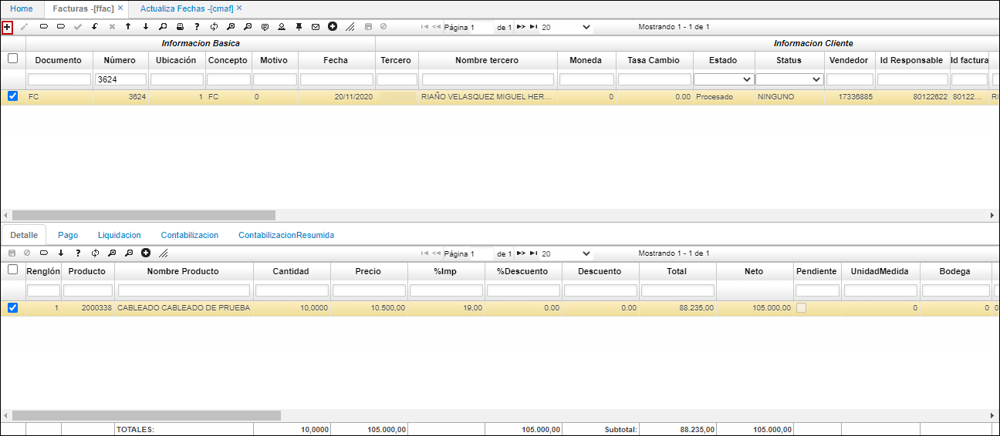
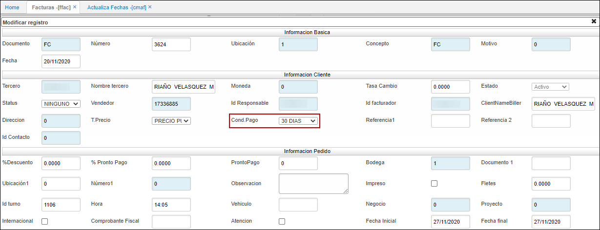
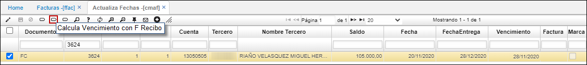
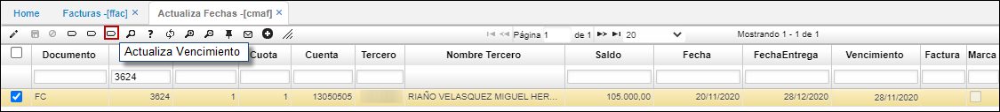

# Actualiza fechas - CMAF

El siguiente manual describe la funcionalidad de la aplicación CMAF – Actualiza Fechas, que hace referencia a la fecha de vencimiento de la factura emitida al cliente.

1. [**Aplicación FFAC-Facturas**](http://docs.oasiscom.com/Operacion/erp/cartera/cmovimient/cmaf#aplicación-ffac-facturas)  
2. [**Funcionalidad Aplicación CMAF-Actualiza Fecha**](http://docs.oasiscom.com/Operacion/erp/cartera/cmovimient/cmaf#funcionalidad-aplicación-cmaf-actualiza-fecha)  
2.1	[**Función Calcula Vencimiento con F Recibo**](http://docs.oasiscom.com/Operacion/erp/cartera/cmovimient/cmaf#función-calcula-vencimiento-con-f-recibo)  
2.2	[**Función Actualiza vencimiento**](http://docs.oasiscom.com/Operacion/erp/cartera/cmovimient/cmaf#función-actualiza-vencimiento)  

## [Aplicación FFAC-Facturas](http://docs.oasiscom.com/Operacion/erp/cartera/cmovimient/cmaf#aplicación-ffac-facturas)  

Al realizar una factura en la aplicación FFAC – Facturas en el maestro de esta aplicación de acuerdo con la Condición de Pago el sistema calcula fecha de vencimiento de la factura y es la que se registra en el módulo de cartera. 

## [Funcionalidad Aplicación CMAF-Actualiza Fecha](http://docs.oasiscom.com/Operacion/erp/cartera/cmovimient/cmaf#funcionalidad-aplicación-cmaf-actualiza-fecha)  
Para que no se presenten inconformidades, de acuerdo con la fecha de vencimiento de la factura VS la entrega de los bienes o servicios, ya que, por demoras en los procesos de despacho y transporte, surge la aplicación CMAF – Actualiza Fechas, esta aplicación tiene dos funcionalidades para realizar la actualización de fecha. 

### [Función Calcula Vencimiento con F Recibo](http://docs.oasiscom.com/Operacion/erp/cartera/cmovimient/cmaf#función-calcula-vencimiento-con-f-recibo)  
Este botón que se encuentra en la parte superior izquierda del maestro, su funcionalidad es tomar la fecha de recibo y le aplica la misma condición de pago que tiene la factura, el sistema realiza un recalculo es decir coloca la fecha de vencimiento con base a la fecha de entrega. 

### [Función Actualiza vencimiento](http://docs.oasiscom.com/Operacion/erp/cartera/cmovimient/cmaf#función-actualiza-vencimiento)  
Este botón nos permite decidir la fecha de vencimiento de la factura ya sea por decisión propia o acuerdo con el cliente. 

