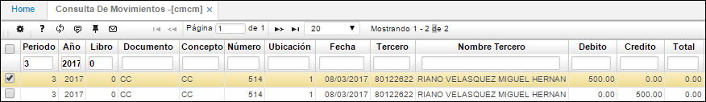
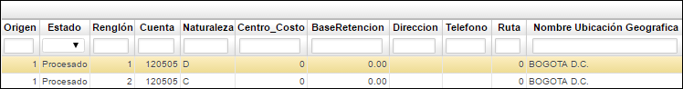

# Consulta de Movimientos - CMCM

El objetivo de esta aplicación es poder consultar los movimientos realizados en un periodo determinado del módulo de cartera.

**Periodo:** mes en el cual se realizó el movimiento.  
**Año:** año en el cual se realizó el movimiento.  
**Libro:** libro contable en el que se realizó el movimiento de cartera. Libro contable 1 - IFRS, libro contable 0 - LOCAL.
**Documento:** Especificación del documento origen que da comienzo al movimiento.  
**Concepto:** Identificación alfanumérica del concepto por el cual se realiza el documento.  
**Número:** Consecutivo en el cual se generó el movimiento.  
**Ubicación:** Identificación numérica de la ubicación en donde se cargo el movimiento.  
**Fecha:** Fecha en la cual se elaboró el movimiento.  
**Tercero:** Número de identificación del tercero.  
**Débito:** Valor débito del movimiento.  
**Crédito:** Valor crédito del movimiento.  
**Total:** Valor total del movimiento.  

**Estado:** Estado en el cual se encuentra el movimiento.  
**Renglón:** Número del consecutivo en el cual se encuentra una determinada cuenta de un movimiento.  
**Cuenta:** Identificación numérica de la cuenta que es afectada por el concepto.  
**Centro costo:** Identificación del centro de costo al que pertenece la cuenta.  
**BaseRetencion:** Valor de retención que se le aplica a un concepto.  
