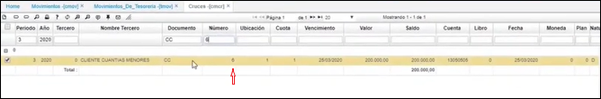
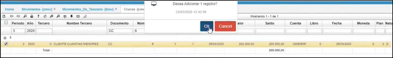
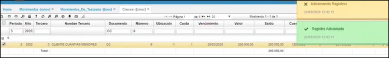
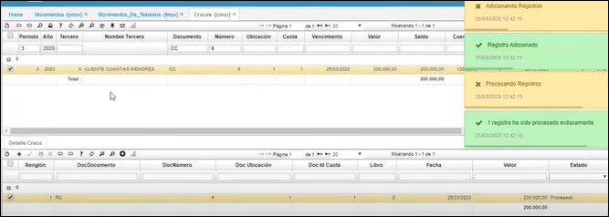

---

layout: default

title: Cruces

permalink: /Operacion/erp/cartera/cmovimient/cmcr

editable: si

---

# Cruces - CMCR

Esta aplicación permite consultar el cruce de cuentas de Cartera, con los respectivos documentos de tesorería o cuentas por pagar para cancelarlas, como también permite el cruce manual de dichos movimientos en los casos que por diferentes motivos no se pudieron efectuar.  

La parte superior de la aplicación nos muestra el valor inicial y saldo de cada una de las cuentas por cobrar, y la parte inferior nos muestra el movimiento con el cual se cruzó o se canceló dicha Cuenta por Cobrar.  

**Entrada:** La entrada de datos a esta aplicación provienen de la aplicación cmov (movimientos) que resultan de movimientos generados con documentos como: cuentas por cobrar, notas crédito, recibos de caja entre otros.  

**Proceso:** El proceso que se realiza en esta aplicación es el de cruzar los diferentes documentos que provienen de la aplicación cmov (movimientos), el proceso consiste en buscar el documento que genere la contrapartida del otro para posteriormente confirmarlo y así saldar el documento que se encuentra pendiente. Al causar los documentes pendientes se actualizan los saldos de las cuentas de los terceros que tienen obligaciones con la empresa.  

**Salida:** Los datos de salida de este proceso se observan en las consultas de los saldos de las cuentas de los terceros, en los reportes de estado de cuenta de los terceros y en las diferentes aplicaciones de consulta del módulo de cartera.  

**Periodo:** Hace referencia al mes el cual se desea consultar.  

**Año:** Año al cual pertenece el periodo antes mencionado.  

**Tercero:** Número de identificación del tercero.  

**Documento:** Iniciales que identifican el tipo de comprobante.  

**Número:** Numero con el cual se generó el documento.  

**Ubicación:** Identificación de la ubicación de un punto de la empresa.  

**Cuota:** Número de la cuota, en caso de pactarse pagos por cuotas.  

**Fecha:** Fecha del documento.  

**Vencimiento:** Al procesar un documento este campo toma la fecha de dicho documento.  

**Valor:** Valor numérico que afecta la cuenta según su naturaleza.  

**Saldo:** Saldo del cruce.  

**Cuenta:** Identificación numérica de las cuentas afectadas, asignada según PUC.  

**Moneda:** Tipo de moneda en la cual se hace el movimiento.  

**Plan:** En este campo se colocara el código del plan del cual se tomaran las cuentas.  

**Naturaleza:** Hace referencia a la naturaleza de la cuenta si es débito o crédito.  

**Dirección:** Corresponde a la dirección del tercero ingresado.  

**Factura:** Número de factura a la cual se le realizará el cruce.  

**Libro:** Número de libro según parametrización en Libros (KLIB).  

### [Cómo realizar el Cruce con las Cuentas por Cobrar](http://docs.oasiscom.com/Operacion/erp/cartera/cmovimient/cmcr#como-realizar-el-cruce-con-las-cuentas-por-cobrar)  

Desde esta aplicación se llama la cuenta por cobrar (en este caso, se utiliza el ejemplo que se realizó en la opción [Causación de Cuentas por cobrar y Cruces desde CMCR](http://docs.oasiscom.com/Operacion/erp/cartera/cmovimient/cmov#causacion-de-cuentas-por-cobrar-y-cruces-desde-cmcr))  

  

En la parte inferior, en el detalle, se realiza el cruce.  Se adiciona un registro **+**; al hacer doble clic en el campo **_DocDocumento_**, el sistema sugiere con qué documento se puede cruzar el registro  

  

Se le da aceptar (parte inferior derecha de la pantalla); luego en la pantalla principal se le da OK  

  

  

Luego, en el detalle, se procesa el cruce:  

  

  

Al procesar el cruce en el detalle y actualizar la información desde el maestro (parte superior), el sistema nos relaciona que ya la cuenta por cobrar quedó con saldo 0 (cero) y que está cruzada bajo el documento de Recibo de caja **_RC_**  

  

De igual manera, se puede validar consultando por el campo **_Documento_** con **_RC_** (Recibo de Caja)  

  

Aquí, también nos muestra la cuenta con saldo 0 (cero) en el maestro y en el detalle, la cuenta por cobrar con la que se realizó el cruce.  

