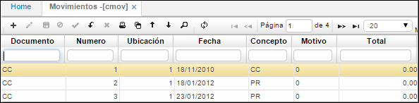

# Movimientos - CMOV

En la aplicación **CMOV** se elaboran los movimientos por los diferentes conceptos que afectan las Cuentas por Cobrar. Esta es la pantalla más importante del módulo de cartera, en ella se registran y consultan todos los movimientos que afectan las Cuentas por Cobrar, unos movimientos son elaborados automáticamente por los otros módulos de OASISCOM por medio de las interfaces establecidas y que son parte de la integridad del Sistema de Información.  

**Documento:** Nombre del tipo de documento que se genera.  
**Número:** Número con el cual se ingresa el movimiento.  
**Ubicación:** Identificación y nombre de la organización que genera el movimiento.  
**Fecha:** Fecha del concepto por el cual se realiza el documento.  
**Concepto:** Código del Concepto por el cual se hace el movimiento. Este define automáticamente la afectación contable del movimiento, por tanto debe estar perfectamente definido.  
**Motivo:** número que identifica un documento para casos especiales a nivel contable, se puede parametrizar los documentos por conceptos en la aplicación BDOC, los motivos se parametrizan desde la aplicación BPLA.  
**Total:** Valor total por el cual de genera el movimiento.  
**Proyecto:** ingresar el número de proyecto correspondiente al movimiento de cartera.  
**Negocio:** ingresar el número de negocio correspondiente al movimiento de cartera.  

**Tercero:** Número de identificación del tercero responsable del movimiento.  
**Nombre Tercero:** Nombre del tercero.  
**Estado:** Estado del documento (Activo, Procesado y Anulado).  
**Dirección:** Identificación numerica de la dirección del tercero.  
**Año:** Año del movimiento.  
**Empleado:** Identificación numérica del empleado enacargado de generar el movimiento.  
**Moneda:** Campo que indica el tipo de moneda a manejar en la generación de los movimientos.  
**ExchangeRate:**  (Tipo de cambio) Valor equivalente de la moneda local dependiendo el tipo de moneda manejado en el movimiento.  

**Renglón:** Consecutivo generado que se manejan en el comprobante.  
**Cuenta:** Identificación numérica de las cuentas afectadas.  
**Naturaleza:** Hace referencia a la naturaleza de la cuenta si es débito o crédito.  
**Valor:** Valor numérico que afecta la cuenta según su naturaleza.  
**Tercero:** Número de identificación del tercero.  
**Centro Costo:** Identificación numérica del centro de costo al cual pertenece la cuenta.  
**Negocio:** Identificación numérica del negocio.  
**Proyecto:** Identificación numérica del proyecto.  
**Base Retención:** Valor al cual se le debe liquidar la retención que se le aplica de acuerdo al concepto.  
