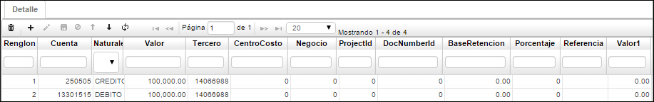
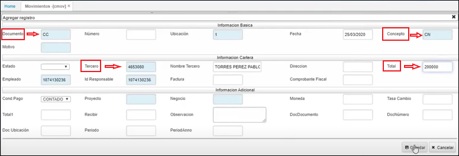
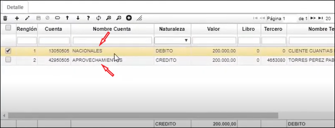
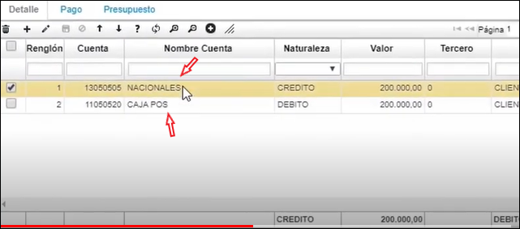

# Movimientos - CMOV  

En esta aplicación se encuentra documentado el siguiente proceso:  

[Causación de Cuentas por cobrar](http://docs.oasiscom.com/Operacion/erp/cartera/cmovimient/cmov#causación-de-cuentas-por-cobrar)

En la aplicación **CMOV** se elaboran los movimientos por los diferentes conceptos que afectan las Cuentas por Cobrar. Esta es la pantalla más importante del módulo de cartera, en ella se registran y consultan todos los movimientos que afectan las Cuentas por Cobrar, unos movimientos son elaborados automáticamente por los otros módulos de OASISCOM por medio de las interfaces establecidas y que son parte de la integridad del Sistema de Información.  

**Documento:** Nombre del tipo de documento que se genera.  
**Número:** Número con el cual se ingresa el movimiento.  
**Ubicación:** Identificación y nombre de la organización que genera el movimiento.  
**Fecha:** Fecha del concepto por el cual se realiza el documento.  
**Concepto:** Código del Concepto por el cual se hace el movimiento. Este define automáticamente la afectación contable del movimiento, por tanto debe estar perfectamente definido.  
**Motivo:** número que identifica un documento para casos especiales a nivel contable, se puede parametrizar los documentos por conceptos en la aplicación BDOC, los motivos se parametrizan desde la aplicación BPLA.  
**Total:** Valor total por el cual de genera el movimiento.  
**Comprobante Fiscal:** ingresar el número de comprobante fiscal.  
**Proyecto:** ingresar el número de proyecto correspondiente al movimiento de cartera.  
**Negocio:** ingresar el número de negocio correspondiente al movimiento de cartera.  

**Tercero:** Número de identificación del tercero responsable del movimiento.  
**Nombre Tercero:** Nombre del tercero.  
**Estado:** Estado del documento (Activo, Procesado y Anulado).  
**Dirección:** Identificación numerica de la dirección del tercero.  
**Año:** Año del movimiento.  
**Empleado:** Identificación numérica del empleado enacargado de generar el movimiento.  
**Moneda:** Campo que indica el tipo de moneda a manejar en la generación de los movimientos.  
**ExchangeRate:**  (Tipo de cambio) Valor equivalente de la moneda local dependiendo el tipo de moneda manejado en el movimiento.  

**Renglón:** Consecutivo generado que se manejan en el comprobante.  
**Cuenta:** Identificación numérica de las cuentas afectadas.  
**Naturaleza:** Hace referencia a la naturaleza de la cuenta si es débito o crédito.  
**Valor:** Valor numérico que afecta la cuenta según su naturaleza.  
**Tercero:** Número de identificación del tercero.  
**Centro Costo:** Identificación numérica del centro de costo al cual pertenece la cuenta.  
**Negocio:** Identificación numérica del negocio.  
**Proyecto:** Identificación numérica del proyecto.  
**Base Retención:** Valor al cual se le debe liquidar la retención que se le aplica de acuerdo al concepto.  

### [Causación de Cuentas por cobrar](http://docs.oasiscom.com/Operacion/erp/cartera/cmovimient/cmov#causación-de-cuentas-por-cobrar)  

Se ingresa a la aplicación **CMOV - Movimientos** de Cuentas por cobrar y se adiciona un nuevo registro **_+_**: en el campo **_documento_** se coloca **_CC_** (de cuentas por cobrar), en el campo **_concepto_** para el ejemplo de la imagen, se coloca **_CN_** (de Cliente nacional),  en el campo **_tercero_** se busca el cliente a quien le vamos a realizar la cuenta por cobrar, en el campo **_total_** se digita el valor de la cuenta por cobrar, luego se guarda.  

Al guardar y tener previamente parametrizadas las plantillas, el sistema nos va a sugerir las dos cuentas contables que se causan en el movimiento.  

  

Al procesar, ya nos queda causada la cuenta por cobrar.  

  

Luego, para hacer la explicación de la aplicación **CMCR - Cruces**, registraremos un recaudo de esta cartera; esto lo hacemos desde el módulo de tesorería **TMOV - Movimientos**: adicionamos un nuevo registro **+**, adicionamos un nuevo movimiento desde el **_Documento_** **RC** (de Recibo Recaudo), con el **_Concepto_** **CN** (de Clientes Nacionales), con el **_Tercero_** que tiene la causación de la cuenta por cobrar y en **_Total_**, el valor a recaudar.  

  

Al guardar, el sistema parametrizado previamente en las plantillas, va a sugerir las dos cuentas contables que se causan en el recaudo:  

  

Cuando se procesa el registro, no se realiza ningún cruce  

  

Este registro o movimiento de cruce, se hace desde la opción [Cómo realizar el Cruce con las Cuentas por Cobrar](http://docs.oasiscom.com/Operacion/erp/cartera/cmovimient/cmcr#cómo-realizar-el-cruce-con-las-cuentas-por-cobrar)

