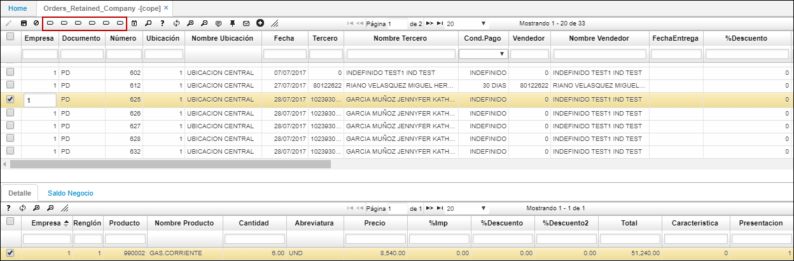

# COPE- Ordenes Retenidas por Compañía

La aplicación **COPE** muestra la información de los pedidos retenidos de todas las empresas a las que el usuario tenga permisos, igualmente, la aplicación cuenta con filtros que permiten facilitar la consulta.  

Desde allí, el usuario puede liberar, devolver o rechazar los pedidos haciendo uso de los botones _Libera cartera, Devuelve cartera, Rechaza cartera, Libera comercial, Devuelve comercial, Rechaza comercial_.  

En el detalle podemos ver los productos que conforman la orden de pedido.  

