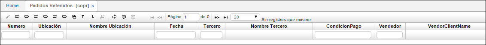
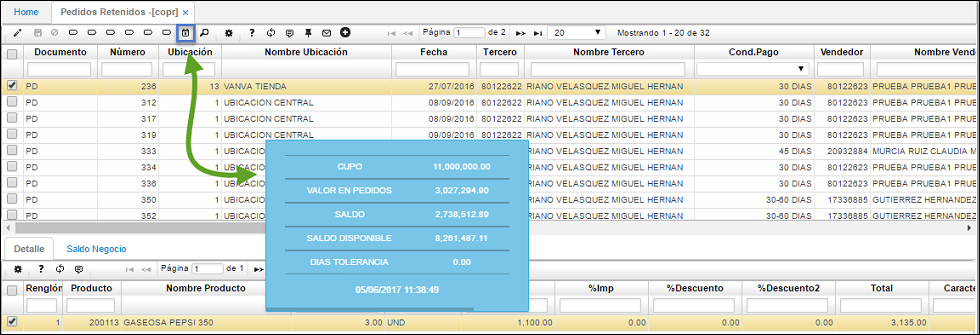

# Pedidos Retenidos - COPR

Esta aplicación se utiliza para _liberar, rechazar, o devolver_ pedidos que se hayan generado anteriormente.

Los pedidos pueden ser retenidos por Cartera o por Comercial. Para liberar un pedido que se encuentre retenido por cartera se debe validar con el área de cobranza si es viable liberar dicho pedido, de ser así seleccionamos el pedido y damos click en el botón superior de la barra de herramientas _Liberar_Cartera_. 

**Número:** Número con el cual se generó el documento.  
**Ubicación:** Identificación de la ubicación de un punto de la empresa.  
**Tercero:** Número de identificación del tercero.  
**Nombre Tercero:** Nombre del tercero.  
**Condición de pago:** Establece la condición de pago con la que se generó el documento.  
**Vendedor:** Identificación del vendedor.  
**Fecha de entrega:** Fecha de entrega del pedido.  
**% Descuento:** Indica el valor del porcentaje que se realizó.  
**Total:** Valor total por el cual de genera el movimiento.  
**Comercial:** Indica la sigla según el estado actual de la condición comercial del pedido.  
**Observación:** Campo de las observaciones que se realizaron.  
**Estado:** Indica el estado de la transacción.  
**Cupo:** Capacidad de crédito otorgada al tercero.  
**Pronto pago:** Descuento establecido por pronto pago.  

## [Consultas dinámicas](http://docs.oasiscom.com/Operacion/erp/cartera/coperacion/copr/#consultas-dinámicas)

Realización de una consulta dinámica en la aplicación _COPR - Pedidos Retenidos_.  

