# Pedidos Retenidos - COPR

En la aplicación COPR – Pedidos retenidos, quedan los pedidos que han sido retenidos por distintos motivos, ya sea por comercial o por cartera. Por ejemplo, un pedido puede quedar retenido en caso de que se le haya cambiado el precio o se haya realizado un descuento sobre el mismo, o porque el cliente que lo solicita ya no cuenta con cupo o tiene la cartera vencida.
Para que el sistema tenga en cuenta este tipo de controles, se debe realizar una parametrización previa, la cual se explica a continuación. Esta aplicación se utiliza para _liberar, rechazar, o devolver_ pedidos que se hayan generado anteriormente.  

* [Parametrización aplicación Básico Ubicaciones - BUBI](http://docs.oasiscom.com/Operacion/erp/cartera/coperacion/copr#parametrización-aplicación-básico-ubicaciones-bubi)  
>+ [Parametrización aplicación Empresas - SEMP](http://docs.oasiscom.com/Operacion/erp/cartera/coperacion/copr#parametrización-aplicación-empresas-semp)  
>+ [Proceso aplicación Pedidos Retenidos - COPR](http://docs.oasiscom.com/Operacion/erp/cartera/coperacion/copr#proceso-aplicación-pedidos-retenidos-copr)
>+ [Consultas dinámicas](http://docs.oasiscom.com/Operacion/erp/cartera/coperacion/copr#consultas-dinámicas)

Los pedidos pueden ser retenidos por Cartera o por Comercial. Para liberar un pedido que se encuentre retenido por cartera se debe validar con el área de cobranza si es viable liberar dicho pedido. 

**Número:** Número con el cual se generó el documento.  
**Ubicación:** Identificación de la ubicación de un punto de la empresa.  
**Tercero:** Número de identificación del tercero.  
**Nombre Tercero:** Nombre del tercero.  
**Condición de pago:** Establece la condición de pago con la que se generó el documento.  
**Vendedor:** Identificación del vendedor.  
**Fecha de entrega:** Fecha de entrega del pedido.  
**% Descuento:** Indica el valor del porcentaje que se realizó.  
**Total:** Valor total por el cual de genera el movimiento.  
**Comercial:** Indica la sigla según el estado actual de la condición comercial del pedido.  
**Observación:** Campo de las observaciones que se realizaron.  
**Estado:** Indica el estado de la transacción.  
**Cupo:** Capacidad de crédito otorgada al tercero.  
**Pronto pago:** Descuento establecido por pronto pago.  

## [Parametrización aplicación Básico Ubicaciones - BUBI](http://docs.oasiscom.com/Operacion/erp/activos/hsaldo/hssp#verificación-de-saldos-de-activos-fijos-ingresados-por-ofac---facturas-de-compra)

En la aplicación BUBI – Básico de Ubicaciones, se debe activar el flag del campo “ApprovesOrder” para el pedido con el cual se requiere tener este control de aprobación, como se muestra en la siguiente imagen:  

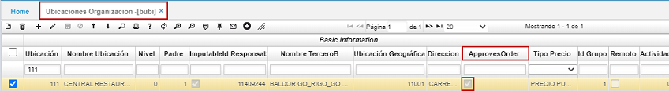  

## [Consultas dinámicas](http://docs.oasiscom.com/Operacion/erp/cartera/coperacion/copr#consultas-dinámicas) 

Adicional a la parametrización que se debe realizar en la aplicación BUBI – Básico de ubicaciones, en la aplicación SEMP-Empresas, se deben realizar las siguientes parametrizaciones para que el sistema tenga en cuenta los controles que se requieren.  Primero, encontramos los campos “Validate Credit” y “Validate Comercial”, para los cuales, de acuerdo con el control que se requiera, se deben activar ambos o únicamente uno de ellos, con el cual, el sistema hará la validación correspondiente.  

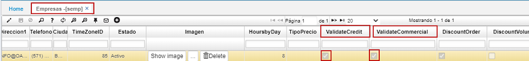  

Luego, en los campos “RoleReceivablesId” y “RoleCommercialId” se deben dejar definido los roles que podrán realizar el proceso correspondiente en el módulo de retención de pedidos, ya sea liberar, devolver o rechazar el pedido.  

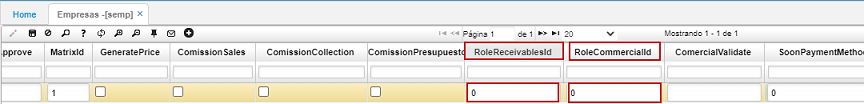  

## [Consultas dinámicas](http://docs.oasiscom.com/Operacion/erp/cartera/coperacion/copr#consultas-dinámicas) 

Con base a estos ajustes, en la aplicación COPR – Pedidos retenidos, se evidencian los pedidos que han sido retenidos. En dicha aplicación se identifica la razón por la cual el pedido se encuentra retenido, si por crédito o por comercial. Como ejemplo, en la siguiente imagen, se aprecia que el pedido se encuentra retenido por cartera, pero en cuanto al proceso comercial sí cumple.  

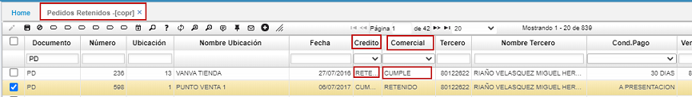  

**Nota**: Dependiendo del proceso por el cual haya sido retenido el pedido, en la aplicación COPR - Pedidos retenidos se puede dejar un comentario especificando dicho motivo, para que el vendedor pueda identificar, por ejemplo, por qué el pedido fue devuelto o rechazado.  

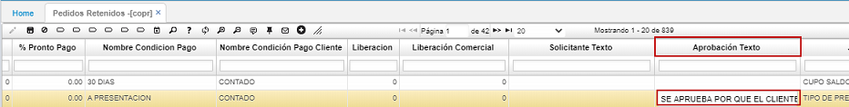  

Para determinar el curso del pedido, se encuentran las siguientes opciones:  

- “Libera_cartera” o “Libera_comercial”, para esta opción, la persona autorizada puede liberar el pedido en el botón correspondiente de acuerdo con el motivo por el que haya quedado retenido para que pueda continuar con su proceso de alistamiento, en caso de considerarlo así. Al liberar el pedido, el status de este cambia a "Pendiente por despacho” en la aplicación **Pedidos - VPED** y a “Aprobado” en el campo correspondiente.  

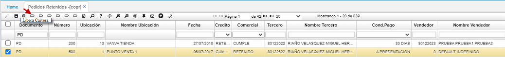  

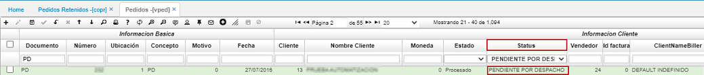  

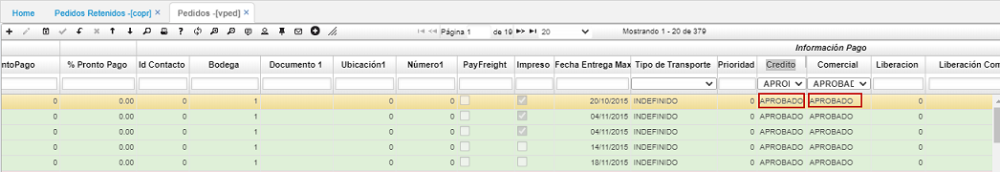  

- “Devuelve_cartera” o “Devuelve_comercial”. Esta opción se selecciona en caso de identificar que el pedido no cumple con determinados parámetros. Al seleccionar esta opción, para el proceso que corresponda, el status del pedido en la aplicación VPED – Pedidos cambiará a “Devuelto”.  

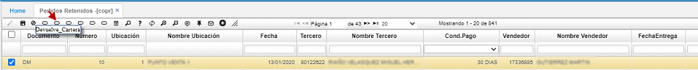  

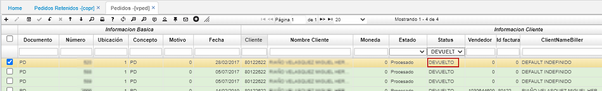  

- “Rechaza_cartera” o “Rechaza_comercial”. Esta opción se selecciona en caso de considerar que el pedido no puede ser facturado bajo ningún motivo. Automáticamente al rechazarlo, el sistema reversa y anula el pedido y su estado, en el campo correspondiente cambia a “Rechazado”.  

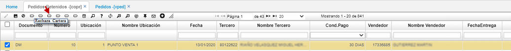  

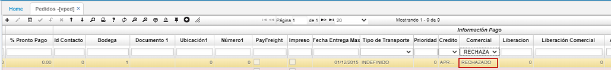

Nota: Un pedido puede quedar retenido por ambas razones, tanto por comercial, como por cartera. Si el pedido es aprobado por comercial, pero se encuentra aún retenido por cartera, el pedido no cambiará su status a “Pendiente por despacho” en VPED – Pedidos, hasta que sea aprobado por cartera. 

## [Consultas dinámicas](http://docs.oasiscom.com/Operacion/erp/cartera/coperacion/copr#consultas-dinámicas)

Realización de una consulta dinámica en la aplicación _COPR - Pedidos Retenidos_.  

