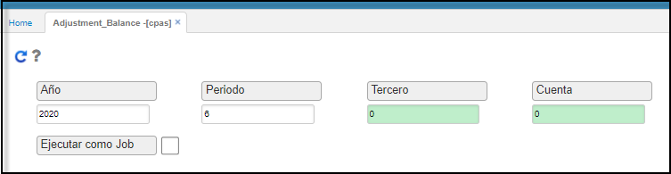

# Ajustes de Saldos de Cartera - CPAS

La aplicación **CPAS** es un proceso automático especial el cual se debe ejecutar al fin de cada mes, este a su vez recorrerá todas las cuentas de cartera y si tienen saldos débito o crédito menores a cierto valor el sistema insertara un documento o registro en la aplicación **CMOV** nota débito o crédito llevando los  valores a ingresos o gastos dependiendo cual sea el caso.

