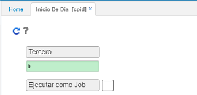

# Inicio de Día - CPID  

Proceso en el cual se actualizan al día variables como el cálculo de los días de rotación de cartera.  

  

##  Cálculo de Rotación de Cartera   

El cálculo de los días de rotación de cartera se basa en obtener los días que han pasado entre la fecha de creación de la factura o las facturas y la fecha de sus respectivos pagos. Los días de rotación será el promedio de esos días en un periodo de tiempo analizado, que para este proceso será de 6 meses hacia atrás, contados desde la ejecución del proceso en la aplicación CPID – Inicio de día.
Con el fin de explicar el cálculo mencionado anteriormente, a continuación, se muestra un ejemplo:  

  

Para visualizar dicho promedio, se debe tener en cuenta lo que se explica a continuación.  

##  Aplicación CPID  

Para realizar el respectivo cálculo de los días de rotación de cartera, se debe ejecutar el proceso en la aplicación CPID – Inicio de día, ya sea para un cliente específico, o para todos los clientes. Si se desea realizar el cálculo para todos los clientes que tienen saldo a la fecha se debe diligenciar el cero “0” en el campo tercero.  

  

Una vez este proceso sea ejecutado satisfactoriamente, en el detalle de la aplicación BTER – Terceros, en la pestaña Cartera se puede evidenciar la información de los días de rotación de cartera en el campo “Rotación”.  

  

##   Aplicación CSSP - Saldos de Cartera  

En la aplicación CSSP – Saldos de Cartera, se evidencian aquellos terceros con sus respectivas cuentas que se encuentran con saldo actualmente, en donde se tendrán en cuenta las facturas que, para este proceso, se encuentren dentro del lapso de tiempo de 6 meses hacia atrás, contados desde la fecha de la ejecución del proceso CPID.  

  

Es importante tener en cuenta que el proceso de cálculo de rotación de cartera se hará únicamente para las cuentas que pertenezcan al módulo de cartera, lo cual se puede evidenciar en la aplicación BCUE - Cuentas, como se muestra en la siguiente imagen:  

  

