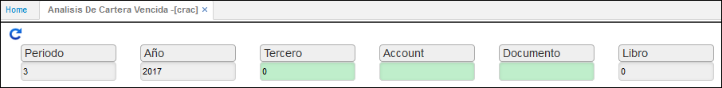

# Análisis de Cartera Vencida - CRAC

Reporte en el cual se totaliza los saldos de Cartera e índices de morosidad. Por periodos con la relación de documentos (movimientos) que soportan el estado de cartera, indicando el porcentaje de participación en el total, tanto del cliente como de la cuenta como del total general.  

**Periodo**
**Año:**
**Tercero:**
**Cuenta:**
**Documento:**
**Libro:**

