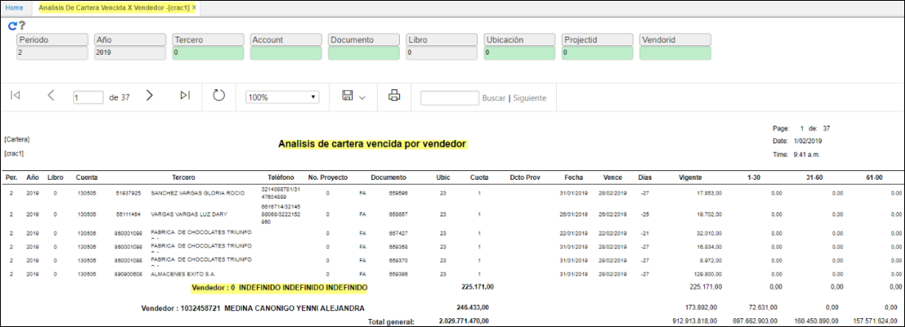

# Análisis de Cartera Vencida por Vendedor - CRAC1

Reporte en el cual se totaliza los saldos de Cartera agrupado por Vendedor; indica los tiempos de morosidad en edades de 1-30 días; 31-60; 61-90; 91-180; 181-360; y superior a un año.
Este reporte nos muestra la cuenta afectada, el tercero que se encuentra en mora, el documento que soporta esa mora con su respectivo número y ubicación, la fecha de registro del documento, los días de vencimiento de ese documento (si los números están en positivo es que ya se ha vencido el documento y si se encuentran en negativo, es porque aún está vigente y faltan esos días para vencerse), este reporte también nos permite visualizar las edades de cartera, es decir, en que rango de días se encuentra vencido dicho documento, si está vigente, o esta entre 1 a 30 días, o entre 31 a 60 días. Esto permite realizar un mejor análisis de la cartera vencida y poder visualizar los documentos con mayor morosidad.  

**Periodo:** mes del cual se desea realizar la consulta.  
**Año:** año de consulta.
**Tercero:** número de identificación del tercero a consultar.  
**Cuenta:** cuenta contable a consultar.  
**Documento:** indicar el documento que se desea consulta.  
**Libro:** ingresar el libro contable del cual se va a realizar la consulta. (Libro 1 - IFRS, libro 0 - LOCAL).  
**Ubicacion:** segun parametrizacion en BUBI  
**Proyector:** segun parametrizacion BPRY.  
**Vendedor:** se filtra por tercero tipo vendedor del basico de terceros BTER.  

