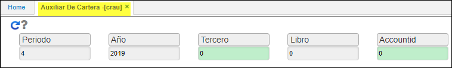
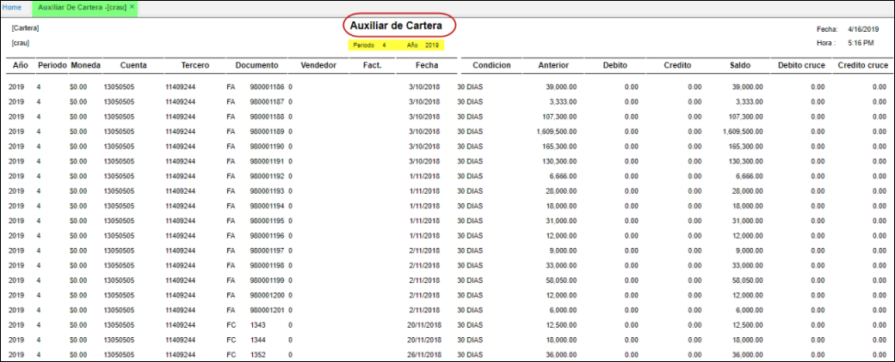

 
# Auxiliar de Cartera - CRAU  

El reporte **CRAU** permite observar los movimientos por clientes de cuentas por cobrar en un determinado periodo, para determinado periodo.  

  

**Periodo:** Mes de consulta.  
**Año:** Año de consulta.  
**Tercero:** Número de identificación del tercero a consultar.  
**Libro:** Indicar el libro contable del cual se desea hacer la consulta, (libro 1 -  IFRS, libro 0 - LOCAL).  
**Cuenta:** Filtro por basico de cuentas realizado en **BCUE.**  

* Datos emitidos despues de la consulta:  

  

