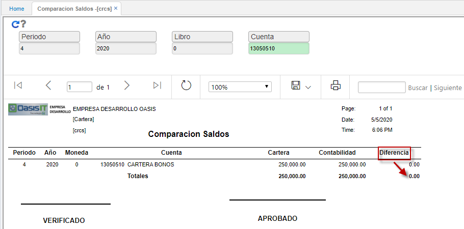

# Comparación Saldos - CRCS

Este reporte permite la validación del estado de los saldos del módulo de cartera frente a los saldos del módulo de contabilidad, indicando si existe alguna diferencia.  

Es posible consultar por periodo, año, libro contable (libro 1 - IFRS, libro 0 - LOCAL) y cuenta contable.  

**Periodo:** Mes del cual se desea realizar la comparación de saldos.  
**Año:** Año del cual se desea realizar la comparación de saldos.  
**Libro:** indicar el libro contable del cual se desea hacer la consulta, (libro 1 -  IFRS, libro 0 - LOCAL).  
**Cuenta:** digitar la cuenta contable de consulta o seleccionarla del zoom.  

El saldo para que esté bien, siempre debe ser Cero (0), o sea, nos indica que está cuadrado el módulo contra la contabilidad.  Esta consulta es muy importante para revisar que el saldo esté en ceros.  

