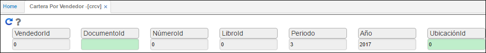

# Cartera por Vendedor - CRCV

La aplicación **CRCV** permite validar la cartera pendiente por vendedor.

Ingresamos los datos de consulta y damos click en el botón _Consultar_  .

**Vendedor:** número de identificación del vendedor a consultar.  
**Documento:** digitar o seleccionar del zoom el documento por el cual se va a consultar la cartera del vendedor.  
**Número:** si se desea buscar algún consecutivo en específico, digitar el número del documento a consultar.  
**Libro:** indicar el libro contable del cual se desea hacer la consulta, (libro 1 -  IFRS, libro 0 - LOCAL).  
**Periodo:** Mes del cual se desea realizar la comparación de saldos.  
**Año:** Año del cual se desea realizar la comparación de saldos.  
**Ubicación:** digitar la cuenta contable de consulta o seleccionarla del zoom.  

