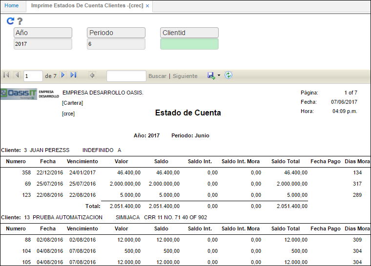
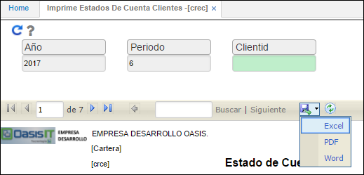

# CREC - Imprime Estados de Cuenta Clientes

La aplicación **CREC** arroja un reporte donde se muestra el estado de cuenta de la cartera de todos los terceros o alguno en específico según la consulta.  

Se realiza el filtro por año, periodo y cliente.  

**Año:** año de consulta.  
**Periodo:** mes del cual se desea realizar la consulta.  
**IdCliente:** número de identificación del cliente a consultar. Si se desea consultar todos los clientes se debe dejar este campo en blanco. El campo _ClienteId_ cuenta con un filtro el cual facilita la búsqueda de clientes.  

Ingresados los datos damos click en el botón _Generar_  y el sistema arrojará el reporte.  

OasisCom permite descargar el reporte en formatos Excel, PDF o Word con el fin de facilitar su análisis.  

