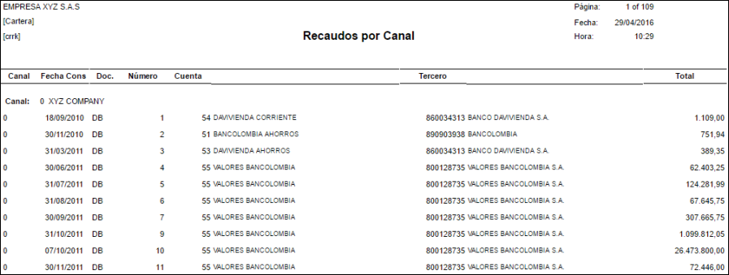

# Recaudo por Canal - CRRK

El reporte **CRRK** permite ver el recaudo que se realiza por el canal de consulta.

Ingresamos los datos de consulta y damos click en el botón _Consultar_  .

**Canal:** número del canal a consultar.  
**Documento:** digitar o seleccionar del zoom el documento por el cual se va a consultar el recaudo por canal.  
**Número:** si se desea buscar algún consecutivo en específico, digitar el número del documento a consultar.  
**Ubicación:** digitar o seleccioncar del zoom la ubicación correspondiente al canal de consulta.  
**Fecha:** seleccionar la fecha de consulta del recaudo.  

El sistema mostará un reporte como el siguiente:

