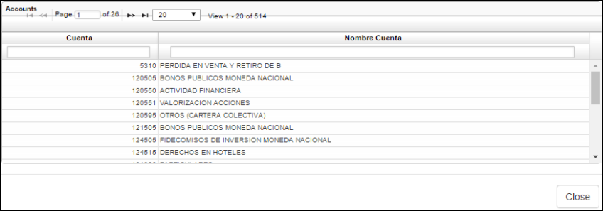
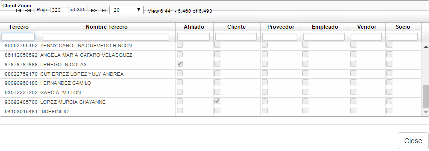
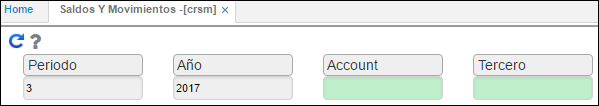

# Saldos y Movimientos - CRSM

El reporte **CRSM** permite visualizar todos los saldos y movimientos realizados en el módulo de Cartera en un determinado periodo. 

Se puede filtrar por periodo, año, cuenta o tercero. En caso de querer visualizar los saldos y movimientos de todos los terceros o de todas las cuentas, en estos campos no diligenciaremos nada. Si desconocemos alguno de estos dos números, cuenta o tercero, para hacer el respectivo filtro damos doble click en el campo correspondiente y seleccionamos la cuenta o tercero de consulta.  

Zoom del filtro _Cuenta_

Zoom del filtro _Tercero_

Reporte CRSM

**Periodo:** Mes del cual se desea realizar la consulta de saldos y movimientos.  
**Año:** Año del cual se desea realizar la consulta de saldos y movimientos.  
**Cuenta:** digitar la cuenta contable de consulta o seleccionarla del zoom.  
**Tercero:** digitar o seleccionar del zoom el número de identificación del tercero del cual se desea realizar la consulta de saldos y movimientos.  

