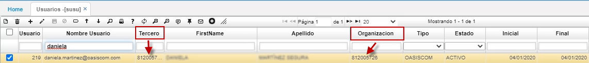
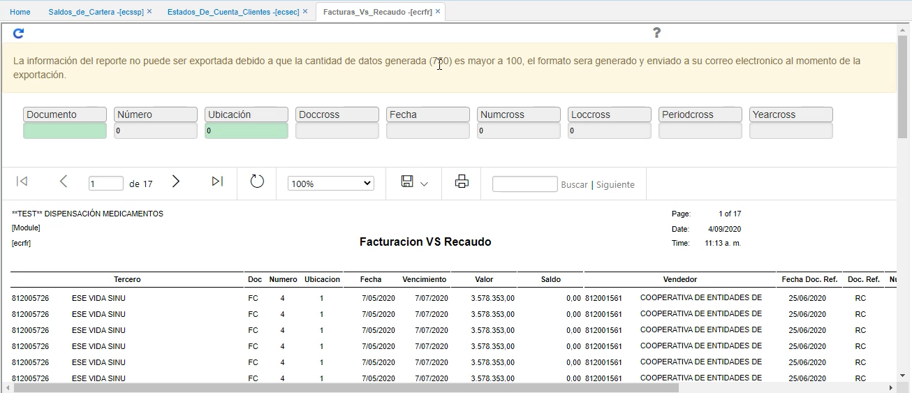
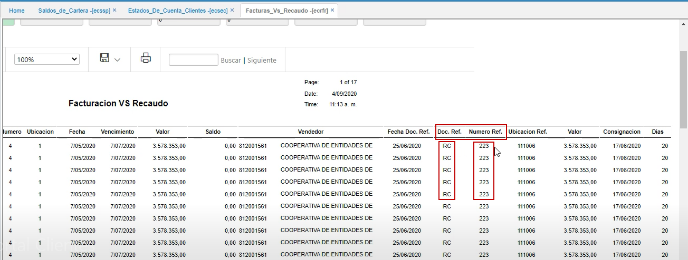

 
# Facturas VS Recaudo - ECRFR  

Primero que todo, es importante conocer la parametrización en la aplicación **Usuarios - SUSU**.  Al tercero que corresponda, se le debe entrar a asociar el NIT o cédula del cliente, tanto en el campo _Tercero_ como en el campo _Organización_.  

  

En esta aplicación, el cliente puede entrar a revisar las facturas que ha pagado y contra cuál recibo de caja se tiene asociado.  

 

En la parte derecha, aparecen los campos _Doc.Ref._ y _Num.Ref._, que hacen referencia al _Recibo de caja_ con el cual se realizó el recuado de esa cartera.  

 
