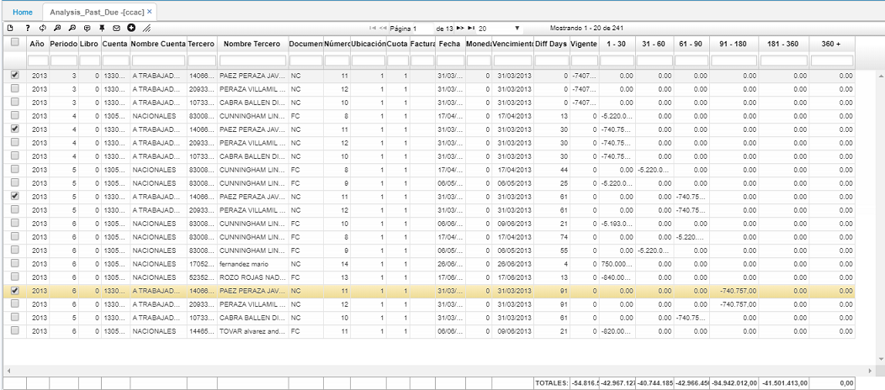

---

layout: default
title: Análisis de Cartera Vencida
permalink: /Operacion/erp/cartera/csaldo/ccac
editable: si

---

# Análisis de Cartera Vencida - CCAC

La aplicación **CCAC** es un análisis de cartera que nos permite filtrar a través de un período y año determinados, la cartera a la fecha.  En las columnas de la parte derecha se puede ver que el sistema clasifica de acuerdo a la vigencia.  En cada columna se pueden ver los saldos.  

