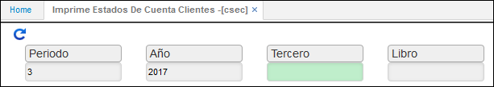
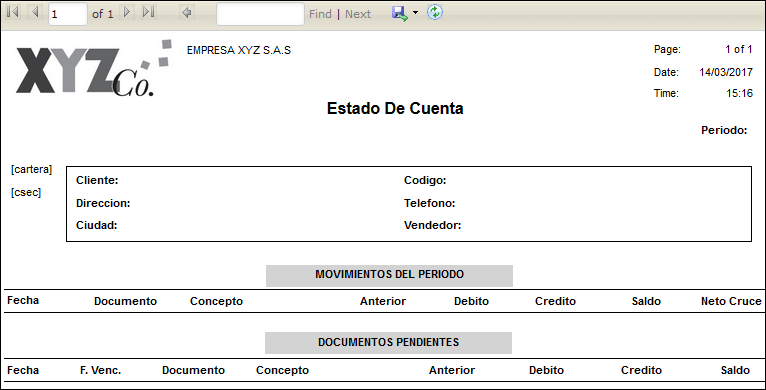

## Imprime Estados de Cuenta Clientes - CSEC

Esta aplicación permite imprimir el estado de cuenta de nuestros clientes, para ello se debe ingresar el periodo, año e identificación del tercero y pulsar el botón consultar.  

La siguiente grafica ilustra el proceso.  

  

Al consultar arrojará un informe del siguiente estilo.  

