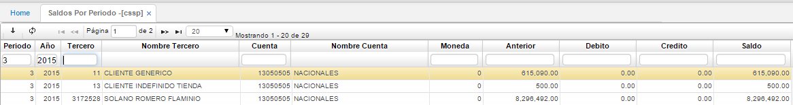
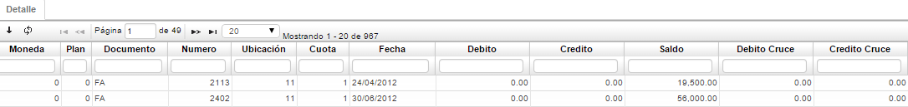

# Saldos por Periodo - CSSP

OasisCom es un sistema en línea, es decir, es afectado por cada uno de los movimientos efectuados por cualquier proceso, se tienen los saldos periódicos con el fin de facilitar la emisión de estados de cuentas, extractos o balances y para la consolidación de la información con el módulo de Contabilidad.  

Consulta de saldos de cartera por periodo especifico, año, tercero o cuenta.  

**Periodo:** Periodo consultado  
**Año:** Año del periodo consultado.  
**Tercero:** Número de identificación del cliente.  
**Nombre del Tercero:** se muestra automáticamente después de diligenciar el número de identificación en el campo TERCERO.  
**Cuenta:** Cuenta correspondiente según PUC.  
**Nombre de cuenta:** Nombre de la cuenta correspondiente según PUC.  
**Moneda:** Tipo de moneda en la cual se maneja el saldo en cartera.  
**Anterior:** Saldo inicial del periodo consultado.  
**Débito:** Total de movimientos débitos del periodo consultado.  
**Crédito:** Total de movimientos crédito del periodo consultado.  
**Saldo:** Saldo Final del periodo consultado.  

**Moneda:** Tipo de Moneda que se maneja.  
**Plan:** En este campo se colocara el código del plan del cual se tomaran las cuentas.  
**Documento:** Iniciales del documento que soporta los movimientos.  
**Número:** Consecutivo del documento o tipo de movimiento.  
**Ubicación:** Ubicación organizacional que genero el documento.  
**Cuota:** Número de la cuota, en caso de pactarse pagos por cuotas.  
**Fecha:** Fecha del documento.  
**Débito:** Movimientos débitos del documento.  
**Crédito:** Movimientos crédito del documento.  
**Saldo:** Saldo del documento en caso de aplicación parcial o no aplicación.  
**Cruce Débito:** Valores dedito aplicados de dicho documento en el periodo consultado.  
**Cruce Crédito:** Valores crédito aplicados de dicho documento en el periodo consultado.  

