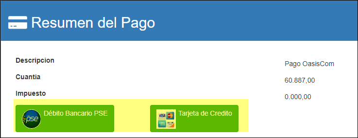
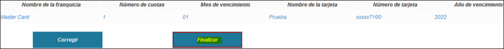

# Saldos de Cartera - ECSSP

Aplicación que permite realizar pago según medio de la transacción.  

Para que los clientes puedan consultar los saldos de cartera pendientes por pagar en la aplicación ECSEC, es importante parametrizar previamente en la aplicación **Usuarios - SUSU**.  Al tercero que corresponda, se le debe entrar a asociar el NIT o cédula del cliente, tanto en el campo _Tercero_ como en el campo _Organización_.  

La aplicación ECSSP arrojará los saldos de cartera pendientes por pagar; allí seleccionamos el saldo que se desea cancelar.  En la parte inferior también se muestran y de igual forma, se pueden eliminar las que se quieran dando click en el botón (-) de la parte derecha, campo _Actions_.  Finalmente, damos click en el botón  de _PayU_.  

  

Lo importante aquí, es que si nuestro cliente de OASISCOM, requiere que sus clientes puedan pagar desde acá, debe haber un acuerdo comercial para poder hacer el pago respectivo.

Al dar click en el botón _Pagar_, el sistema nos direccionará a la siguiente ventana en donde seleccionaremos la forma de pago.  

Al estar configurado en ambos casos la pasarela de Zona Virtual, cualquiera de los dos botones redirigirá a la misma página, donde se seleccionará el medio de pago que será utilizado.  
Se debe seleccionar la opción "Pago Tarjeta de Credito" y dar clic en el botón "Clic para continuar con el pago" y así poder ingresar los datos de la tarjeta de credito.  

Se deben diligenciar los datos de la tarjeta de credito y luego dar clic en el boton "Continuar". Importante solo el número de la tarjeta es predefinido; en el archivo adjunto se encuetran los datos de las tarjetas que pueden ser utilizados.  

Indicamos que se va a finalizar la transacción.  

La pasarela muestra que la transacción quedo pendiente para que el sistema la resuelva después.  

* EPAY *  [PAGOS]
 
Oasiscom valida el estado de la transacción cada 7 minutos hasta que retorna el estado APROBADA, RECHAZADA o PENDIENTE.  
Desde la aplicacion **EPAY**  [PAGOS].
	Pendiente.

	Aprobada.

