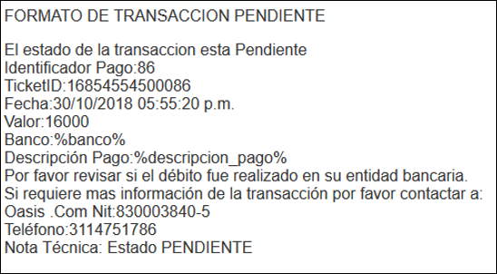

# ECSSP - Saldos de Cartera

Aplicación que permite realizar pago según medio de la transacción.  

La aplicación ECSSP arrojará los saldos de cartera pendientes por pagar,allí seleccionamos el saldo que se desea cancelar y damos click en el botón .  

Al dar click en el botón _Pagar_, el sistema nos direccionará a la siguiente ventana en donde seleccionaremos la forma de pago.  

Al estar configurado en ambos casos la pasarela de Zona Virtual, cualquiera de los dos botones redirigira a la misma página, donde se seleccionará el medio de pago que será utilizado.  
Se debe seleccionar la opción "Pago Tarjeta de Credito" y dar clic en el botón "Clic para continuar con el pago" y así poder ingresar los datos de la tarjeta de credito.  

Se deben diligenciar los datos de la tarjeta de credito y luego dar clic en el boton "Continuar". Importante solo el número de la tarjeta es predefinido; en el archivo adjunto se encuetran los datos de las tarjetas que pueden ser utilizados.  

Indicamos que se va a finalizar la transacción.  

La pasarela muestra que la transacción quedo pendiente para que el sistema la resuelva después.  

**EPAY**
Oasiscom valida el estado de la transacción cada 7 minutos hasta que retorna el estado APROBADA o RECHAZADA.  
desde la aplicacion **EPAY**
Pendiente.

Aprobada.

