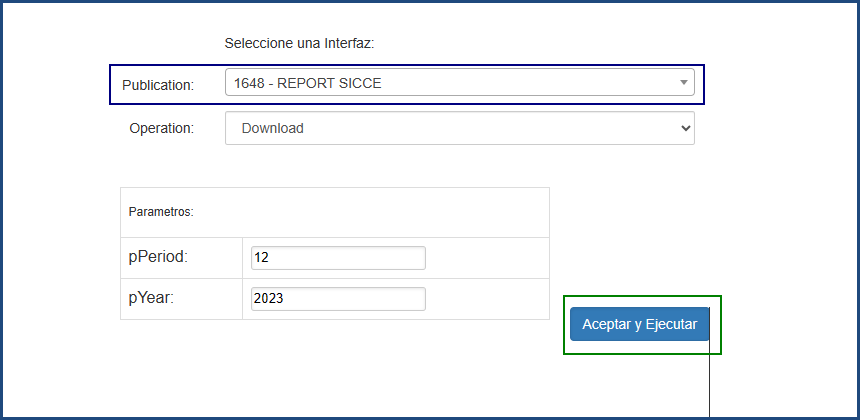
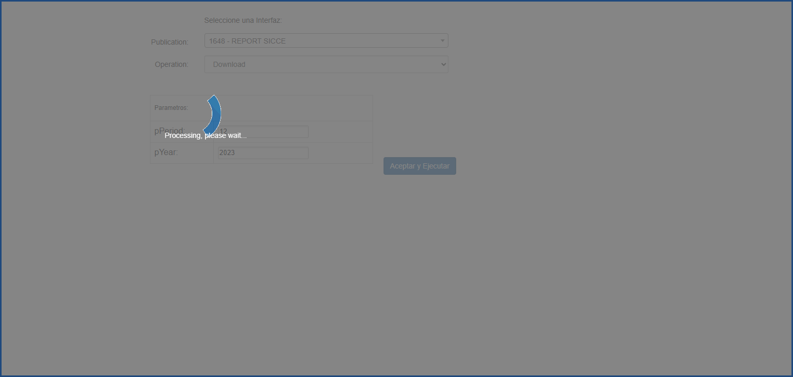

# REPORTE DE SALDOS DE CREDITO

Este reporte trae un detallado sobre los créditos vigentes hasta el periodo y año diligenciado.

Información Como: 
  - Fecha de Desembolso
  - Fecha de vencimiento
  - Morosidad
  - Tipo de Cuota
  - Altura cuota
  - Amortización
  - Modalidad
  - Tasa de interés
  - Valor del préstamo
  - Valor de la cuota (fija)
  - Saldo Capital
  - Saldo interés
  - Otros Saldos
  - Garantía
  - Fecha avalúo
  - Deterioro
  - Contingencia
  - Valor cuota extra
  - Fecha ultimo pago
  - Clase garantía
  - Destino crédito
  - Amortización Capital
  - Valor de Mora
Entre otros más.

