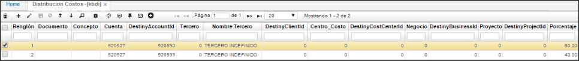

## Distribución de Costos - KBDI

El primer paso para realizar el proceso de distribución de costos es hacer unas parametrizaciones básicas, entre ellas los centros de costo, los respectivos porcentajes y las cuentas contables que van a ser distribuidas. Esta parametrización básica se realiza en la aplicación distribución costos **KBDI** en ella se especifican los porcentajes que va a ser distribuidos en los diferentes centros de costos que maneje la empresa.

**Centro Costo:** Código del centro de costo desde el cual se hace la distribución.
**Tercero:** Cédula del tercero
**Nombre Tercero:** Nombre del tercero
**Actualizado:** Fecha en la que se actualizo el registro

