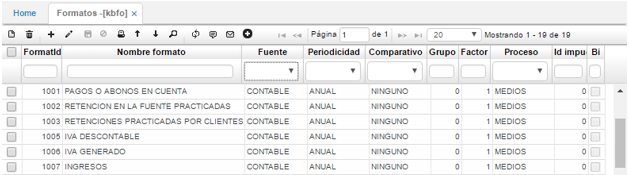
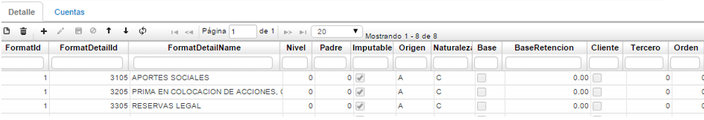
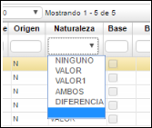
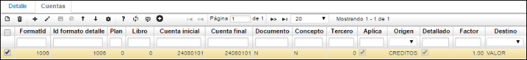

# FORMATOS

## FORMATOS - KBFO

En la aplicación **KBFO** se realiza toda la parametrización correspondiente a los formatos de contabilidad requeridos como lo es medios magnéticos, formatos para la DIAN, entre otros. Esta aplicación se encuentra en el módulo de contabilidad dentro de la carpeta de datos básicos.

La aplicación **KBFO** se parametrizará de la siguiente manera:

En el maestro se parametrizarán cada uno de los formatos a presentar con la siguiente información según corresponda.

**Formato:** en este campo se colocará el código del formato.  
**Nombre formato:** el nombre correspondiente al formato.  
**Fuente:**En este campo se debe seleccionar fuente _contable_, ya que la información se tomará de la parte contable del sistema.  
**Periodicidad:** en este caso para medios magnéticos se seleccionará _anual_.  
**Comparativo:** pra medios magnéticos seleccionar la opción _ninguno_.  
**Grupo:** para medios debe ir el número 0.  
**Factor:** ingresar el número 1 para medios magnéticos.  
**Proceso:** seleccionar el proceso al que pertenece el formato, _medios_.  
**Id impuesto:** número de identificación del impuesto.  

Diligenciados los campos, guardamos el registro dando click en el botón _Guardar_ del maestro.

Una vez parametrizado el maestro se debe realizar la parametrización de cada formato en la pestaña **Detalle**.

En esta pestaña se deben parametrizar cada uno de los subcódigos que pertenece a cada formato.  

**Id Formato Detalle:** En este campo se debe colocar el subcódigo o código de cada formato.  
**Nombre Formato Detalle:** Ingresar el nombre de cada código.  
**Nivel:** ingresar el número 0 para medios magnéticos.  
**Padre:** ingresar el número 0 para medios magnéticos.  
**Imputable:** Este campo tipo checklist deberá estar marcado para que el sistema tome la información de las cuentas imputables.  
**Origen:** ingresar origen _N_.  
**Naturaleza:** seleccionar de la lista desplegable la opción correspondiente.  

**Base:** Este check deberá ser marcado para determinar que el sistema llevará la información de cuantías menores al tercero parametrizado en el campo Tercero.  
**BaseRetención:** En este campo se deberá colocar la base de retención, la cual el sistema buscará para los que no sobrepasen esta base se llevará la información al tercero parametrizado.  
**Tercero:** Este check deberá ser marcado para determinar que el sistema llevará la información al tercero parametrizado en el campo Tercero.  
**Tercero:** Se deberá colocar el código del tercero al cual se llevara la información que no sobrepase la base anteriormente parametrizada. Este tercero deberá existir en el básico de terceros **BTER**.  

En la segunda pestaña **CUENTAS** se llevará a cabo la parametrización de cada una de las cuentas contables de la cual se tomará la información a generar por el proceso de medios magnéticos.  

**Formato:** código del formato asignado en el maestro.  
**Formato Detalle:** subcódigo asignado en la pestaña detalle, correspondiente al formato.  
**Plan:** en este campo se colocará el código del plan del cual se tomarán las cuentas.  
**Libro:** indicar el libro contable (libro 0 - LOCAL, libro 1 - IFRS).  
**Cuenta inicial:** En este campo se deberá colocar la cuenta inicial de donde el sistema tomará la información.  
**Cuenta final:** En este campo se deberá colocar la cuenta final hasta donde el sistema tomará la información.  
**Documento:** este campo debe ir marcado como N si desean que el sistema genere todos los documentos que este rango de cuentas afectó, de lo contrario debe ir el tipo de documento que desee que genere el proceso de Medios Magnéticos.  
**Concepto:** este campo debe ir marcado como N si desean que el sistema genere todos los conceptos que este rango de cuentas afectó, de lo contrario debe ir el tipo de concepto que desee que genere el proceso de Medios Magnéticos.  
**Tercero:** para medios Magnéticos debe ir el número cero _0_.  
**Aplica:** este campo deberá estar marcado para que el sistema tenga en cuenta estas cuentas.  
**Origen:** en este campo se debe definir de donde el sistema tomará la información Si de Saldos, Movimientos, Débitos, Créditos, Débitos y Créditos.  
**Detallado:** este campo se marcará si se requeriré que la información se genere detallada, por documento, concepto, número de documento, ubicación.  
**Factor:** para los medios Magnéticos debe ir el número uno _1_.  
**Destino:** corresponde a la columna en la cual deseamos ver la información, generalmente es _Valor_.  

Finalmente, diligenciados los campos correspondientes, guardamos el registro dando click en el botón _Guardar_ del detalle.  

Cuando ya se han parametrizado los formatos en la aplicación KBFO, el sistema OASISCOM está listo para la generación de dichos medios, teniendo en cuenta la información que reposa en contabilidad.  

Para generar los formatos parametrizados en KBFO ingresaremos a la aplicación [**KPGF - Genera Formatos**](https://github.com/OasisCom/Docs/blob/master/Operacion/erp/contabilidad/kproceso/kpgf.md).