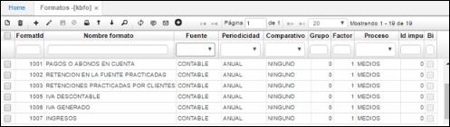
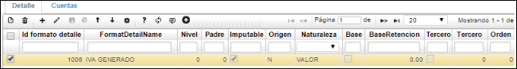

# FORMATOS

## FORMATOS - KBFO

En la aplicación **KBFO** se realiza toda la parametrización para los formatos de contabilidad requeridos como lo es medios magnéticos, formatos para la DIAN entre otros. Esta aplicación se encuentra en el módulo de contabilidad dentro de la carpeta de datos básicos.

La aplicación **KBFO** se parametrizará de la siguiente manera:

En el maestro se parametrizarán cada uno de los formatos a presentar con la siguiente información según corresponda.

**Formato:** En este campo se colocará el código del formato.  
**Nombre formato:** El nombre correspondiente al formato.  
**Fuente:** En este campo debe ser (K) de contable, ya que la información se tomará de la parte contable del sistema y no de la presupuestal.  
**Periodicidad:** según se presente por cada formato, anual, semestral, cuatrimestral, trimestral, bimestral, mensual.  
**Comparativo:** Comparación con el año anterior o ciclo anterior.  
**Proceso:** Proceso al que pertenece el formato: medios, declaración, DANE o ninguno.  
**Id impuesto:** número de identificación del impuesto.  
**Actualizado:** Fecha en la que se actualizo el registro.  

Diligenciados los campos, guardamos el registro dando click en el botón _Guardar_ del maestro.

Una vez parametrizado el maestro se debe realizar la parametrización de cada formato en la pestaña **Detalle**.

...

En esta pestaña se deben parametrizar cada uno de los subcódigos que pertenece a cada formato.

**Formato:** En este campo se colocará el código del formato.  
**Formato Detalle:** En este campo se debe colocar el subcódigo o código de cada formato.  
**Nombre Formato Detalle:** Ingresar el nombre de cada código.  
**Nivel:** Número asignado según parametrización de BCUE.  
**Padre:** Se puede consultar por Grupo el cual consta de dos dígitos o por Cuenta la cual consta de cuatro dígitos.  
**Imputable:** Este campo tipo checklist deberá estar marcado para las cuentas que presentan el ultimo nivel.  
**Origen:** En este campo se debe definir de donde el sistema tomara la información Si de Saldos, Movimientos, Débitos, Créditos, Débitos y Créditos.  
**Naturaleza:** Si es de naturaleza Débito o Crédito.  
**Base:** Seleccionar si va a tener base o monto mínimo.  
**BaseRetención:** En este campo se deberá colocar la base de Retención, la cual el sistema buscara para los que no sobrepasen esta base se llevara la información al tercero parametrizado.  
**Cliente:** Este checklist deberá ser marcado para determinar que el sistema llevará la información al tercero parametrizado en el campo Tercero.  
**Tercero:** Se deberá colocar el código del tercero al cual se llevara la información que no sobrepase la base anteriormente parametrizada. Nota. Este tercero deberá existir en el básico de terceros BTER.  

En la segunda pestaña **CUENTAS** se llevará a cabo la parametrización de cada una de las cuentas contables de la cual se tomará la información a generar por el proceso de medios magnéticos.

Al adicionar un registro el sistema automáticamente colocara los datos de _Año_, _Formato_ y _Código_.

**Formato:** El formato será el código del formato.  
**Formato Detalle:** El código correspondiente al formato.  
**Plan:** En este campo se colocará el código del plan del cual se tomaran las cuentas.  
**Cuenta inicial:** En este campo se deberá colocar la cuenta inicial de donde el sistema tomará la información.  
**Cuenta final:** En este campo se deberá colocar la cuenta final hasta donde el sistema tomará la información.  
**Documento:** documento que deseo ver en el reporte.  
**Concepto:** Concepto que deseo ver en el reporte.  
**Tercero:** tercero que deseo ver en el reporte.  
**Aplica:** Este campo deberá estar marcado para que el sistema tenga en cuenta estas cuentas.  
**Origen:** En este campo se debe definir de donde el sistema tomara la información Si de Saldos, Movimientos, Débitos, Créditos, Débitos y Créditos.  
**Destiny:** Columna donde se va a ver reflejada la información.  

Finalmente, diligenciados los campos correspondientes, guardamos el registro dando click en el botón _Guardar_ del detalle.

