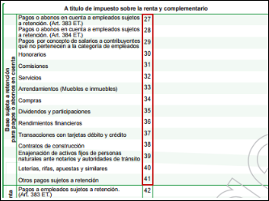
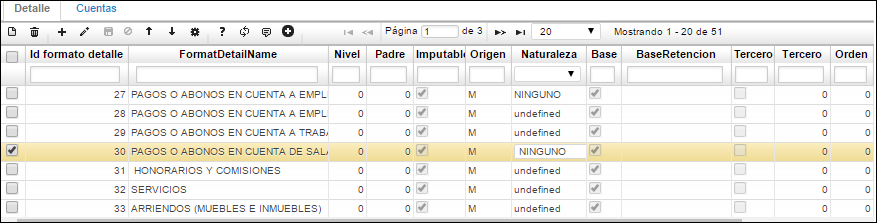
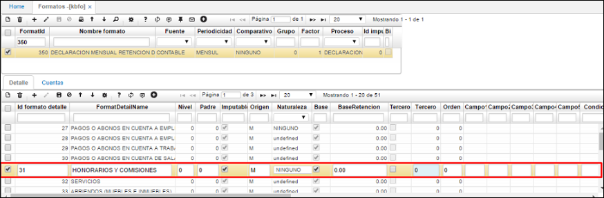
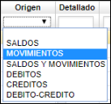

# FORMATOS - KBFO

## [**Medios Magnéticos**](http://docs.oasiscom.com/Operacion/erp/contabilidad/kbasica/kbfo#medios-magnéticos)

En la aplicación **KBFO** se realiza toda la parametrización correspondiente a los formatos de contabilidad requeridos como lo es medios magnéticos, formatos para la DIAN, entre otros. Esta aplicación se encuentra en el módulo de contabilidad dentro de la carpeta de datos básicos.  

La aplicación **KBFO** se parametrizará de la siguiente manera:  

En el maestro se parametrizarán cada uno de los formatos a presentar con la siguiente información según corresponda.  

**Formato:** en este campo se colocará el código del formato.  
**Nombre formato:** el nombre correspondiente al formato.  
**Fuente:** en este campo se debe seleccionar fuente _contable_, ya que la información se tomará de la parte contable del sistema.  
**Periodicidad:** en este caso para medios magnéticos se seleccionará _anual_.  
**Comparativo:** pra medios magnéticos seleccionar la opción _ninguno_.  
**Grupo:** para medios debe ir el número 0.  
**Factor:** ingresar el número 1 para medios magnéticos.  
**Proceso:** seleccionar el proceso al que pertenece el formato, _medios_.  
**Id impuesto:** número de identificación del impuesto.  

Diligenciados los campos, guardamos el registro dando click en el botón _Guardar_ del maestro.  

Una vez parametrizado el maestro se debe realizar la parametrización de cada formato en la pestaña **Detalle**.  

En esta pestaña se deben parametrizar cada uno de los subcódigos que pertenece a cada formato.  

**Id Formato Detalle:** En este campo se debe colocar el subcódigo o código de cada formato.  
**Nombre Formato Detalle:** Ingresar el nombre de cada código.  
**Nivel:** ingresar el número 0 para medios magnéticos.  
**Padre:** ingresar el número 0 para medios magnéticos.  
**Imputable:** Este campo tipo checklist deberá estar marcado para que el sistema tome la información de las cuentas imputables.  
**Origen:** ingresar origen _N_.  
**Naturaleza:** seleccionar de la lista desplegable la opción correspondiente.  

**Base:** Este check deberá ser marcado para determinar que el sistema llevará la información de cuantías menores al tercero parametrizado en el campo Tercero.  
**BaseRetención:** En este campo se deberá colocar la base de retención, la cual el sistema buscará para los que no sobrepasen esta base se llevará la información al tercero parametrizado.  
**Tercero:** Este check deberá ser marcado para determinar que el sistema llevará la información al tercero parametrizado en el campo Tercero.  
**Tercero:** Se deberá colocar el código del tercero al cual se llevara la información que no sobrepase la base anteriormente parametrizada. Este tercero deberá existir en el básico de terceros **BTER**.  

En la segunda pestaña **CUENTAS** se llevará a cabo la parametrización de cada una de las cuentas contables de la cual se tomará la información a generar por el proceso de medios magnéticos.  

**Formato:** código del formato asignado en el maestro.  
**Formato Detalle:** subcódigo asignado en la pestaña detalle, correspondiente al formato.  
**Plan:** en este campo se colocará el código del plan del cual se tomarán las cuentas.  
**Libro:** indicar el libro contable (libro 0 - LOCAL, libro 1 - IFRS).  
**Cuenta inicial:** En este campo se deberá colocar la cuenta inicial de donde el sistema tomará la información.  
**Cuenta final:** En este campo se deberá colocar la cuenta final hasta donde el sistema tomará la información.  
**Documento:** este campo debe ir marcado como N si desean que el sistema genere todos los documentos que este rango de cuentas afectó, de lo contrario debe ir el tipo de documento que desee que genere el proceso de Medios Magnéticos.  
**Concepto:** este campo debe ir marcado como N si desean que el sistema genere todos los conceptos que este rango de cuentas afectó, de lo contrario debe ir el tipo de concepto que desee que genere el proceso de Medios Magnéticos.  
**Tercero:** para medios Magnéticos debe ir el número cero _0_.  
**Aplica:** este campo deberá estar marcado para que el sistema tenga en cuenta estas cuentas.  
**Origen:** en este campo se debe definir de donde el sistema tomará la información Si de Saldos, Movimientos, Débitos, Créditos, Débitos y Créditos.  
**Detallado:** este campo se marcará si se requeriré que la información se genere detallada, por documento, concepto, número de documento, ubicación.  
**Factor:** para los medios Magnéticos debe ir el número uno _1_.  
**Destino:** corresponde a la columna en la cual deseamos ver la información, generalmente es _Valor_.  

Finalmente, diligenciados los campos correspondientes, guardamos el registro dando click en el botón _Guardar_ del detalle.  

Cuando ya se han parametrizado los formatos en la aplicación KBFO, el sistema OASISCOM está listo para la generación de dichos medios, teniendo en cuenta la información que reposa en contabilidad.  

Para generar los formatos parametrizados en KBFO ingresaremos a la aplicación [**KPGF - Genera Formatos**](http://docs.oasiscom.com/Operacion/erp/contabilidad/kproceso/kpgf).  

## [**Formato 350 - Retención en la Fuente**](http://docs.oasiscom.com/Operacion/erp/contabilidad/kbasica/kbfo#formato-350---retención-en-la-fuente)

OasisCom permite generar el formato 350 de retención en la fuente para la DIAN, para ello se debe iniciar con la parametrización en la aplicación KBFO.  

Ingresamos a la aplicación KBFO, agregamos un nuevo registro y diligenciamos los campos de la siguiente manera:  

**Formato Id:** ingresar el número del formato, _350_.  
**Nombre formato:** digitar el nombre asignado al formato, _DECLARACIÓN MENSUAL RETENCIÓN DE LA FUENTE 14_.  
**Fuente:** seleccionar de la lista la opción _CONTABLE_.  
**Periodicidad:** seleccionar de la lista desplegable la opción _MENSUAL_.  
**Comparativo:** seleccionar la opción _NINGUNO_.  
**Grupo:** ingresar grupo _0_.  
**Factor:** ingresar factor _1_.  
**Proceso:** seleccionar de la lista desplegable la opción _DECLARACIÓN_.  
**Id impuesto:** ingresar el número _0_.  

Diligenciados los campos del maestro, damos click en el botón _Guardar_ ubicado en la barra de herramientas y nos dirigimos al detalle de la aplicación, en donde se registrarán los campos contenidos en el Formulario 350 de la Dian.  

**Detalle KBFO**

**Id Formato Detalle:** Ingresar el valor numérico de cada una de las filas contenidas en el formulario.  

**FormatDetailName:** Se ingresa el nombre asociado a cada número de registro, este se encuentra siempre a la izquierda de cada número.  

**Nivel:** ingresar el nivel 0 en todos los registros.  
**Padre:** ingresar el padre 0 en todos los registros.  
**Imputable:** se debe prender este check en todos los registros ingresados.  
**Origen:** digitarla letra M en todos los registros.  
**Base:** se debe prender el check en todos los registros ingresados.  
**TypeTime:** Ingresamos la letra F en todos los registros.  
**DataType:** Ingresamos la letra V en todos los registros.  

Los otros campos deben quedar vacíos o en 0 según corresponda (ver imagen).  

Luego de haber realizado el ingreso de todas las filas definidas por un número en el formulario 350 de la DIAN, seleccionamos el registro al que se le parametrizarán las cuentas o rango de cuentas, en este caso seleccionamos el renglón 31.  

Seleccionado el registro, pasamos a la pestaña _Cuentas_ en el detalle, en donde se ingresarán cada una de las cuentas que pertenecen a este registro de la siguiente manera:  

**Formato Id:** ingresar el número de formato, en este caso el 350.  
**Id Formato Detalle:** ingresar el número de registro seleccionado anteriormente en la pestaña _detalle_.  
**Plan:** si se tiene un plan de cuentas diferente a 0 y se requiere seleccionar una o más cuentas de este, se debe especificar en este campo.  
**Libro:** indicar el libro contable de donde se tomarán las cuentas, Libro 0 - LOCAL, libro 1 - IFRS.  
**Cuenta inicial:** ingresar la primer cuenta de donde se tomarán los movimientos realizados.  
**Cuenta Final:**  Si se desea tener un rango de cuentas se debe indicar una cuenta final, por ejemplo, ingresamos la cuenta 23652010, esto indica que traerá el total de los movimientos o saldos de las cuentas que se encuentren entre la 23652005 (Campo cuenta inicial) y 23652010, si no se desea tener un rango de cuentas y la solo se desea parametrizar una sola cuenta, esta se ingresa en el campo inicial y se repite en el campo final.  
**Documento:** en la parametrización de este formato no aplica un documento, así que se ingresa la letra **N**, sin embargo, si se desea traer solo los movimientos o saldos con un documento específico y las cuentas parametrizadas en los campos Cuenta Inicial y Cuenta Final se debe ingresar el documento en este campo.  
**Concepto:** en la parametrización de este formato no aplica un concepto, así que se ingresa la letra **N**, sin embargo, si se desea traer solo los movimientos o saldos con un concepto específico y las cuentas parametrizadas en los campos Cuenta Inicial y -Cuenta Final se debe ingresar el concepto en este campo.  
**Tercero:** en la parametrización de este formato no aplica tercero, así que se ingresa la letra **N**, sin embargo, si se desea traer solo los movimientos o saldos para un tercero en específico y las cuentas parametrizadas en los campos Cuenta Inicial y Cuenta Final se debe ingresar el tercero en este campo.  
**Aplica:** se debe activar este check para indicar que ese renglón se necesita para consultar, ya sea los movimientos de esas cuentas o los saldos, de lo contrario no realizara el recorrido.  
**Origen:** en este campo se debe elegir de donde se desea traer la información que se generará en el formato, en la parametrización de este se selecciona _Saldos_, pero para otros casos se puede seleccionar: MOVIMIENTOS, SALDOS Y MOVIMIENTOS, DEBITOS, CREDITOS, DEBITO-CREDITO.  
**Detallado:** para este formato, no es necesario activar este check que nos permite generar la información de manera más detallada por documento.  
**Factor:** valor por el cual se multiplicará la información, para este formato aplica el factor 1.  
**Destino:** hace referencia a la columna a donde se enviará la información que estamos generando, en este caso se selecciona _Valor_.  

_Nota:_  Se puede ingresar cuantos renglones sean necesarios para el grupo de cuentas que sumará al valor total del renglón seleccionado en la pestaña _Detalle_.  

Luego de realizar la configuración anterior ingresaremos a la aplicación [**KPGF - Genera Formatos**](http://docs.oasiscom.com/Operacion/erp/contabilidad/kproceso/kpgf), en donde procederemos a generar el formato 350 de la DIAN.  

## [Parametrización para generación de medios magnéticos correspondientes al Ingreso de Activo Fijo por Compras](http://docs.oasiscom.com/Operacion/erp/contabilidad/kbasica/kbfo#parametrización-para-generación-de-medios-magnéticos-correspondientes-al-ingreso-de-activo-fijo-por-compras)

Para la generación de medios magnéticos correspondientes al Ingreso de Activo Fijo por Compras es necesario parametrizar la aplicación _KBFO - Formatos_ de la siguiente manera en la pestaña del detalle **CUENTAS**.  

* En el campo **Cuenta Inicial** se deberá indicar la cuenta contable donde se causó el IVA, cuenta correspondiente al Activo.  
* En el campo **Código** se indicará el código _IVC_.  
* Seguidamente, en el campo **Origen** seleccionar la opción _Movimientos_.

