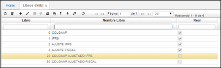
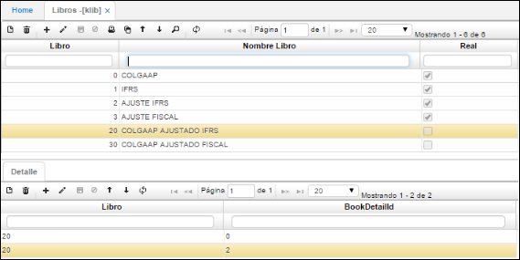

## LIBROS - KLIB

El principal objetivo de la aplicación **KLIB** (multilibro) es permitir la comparación de la información a diferentes niveles, por ejemplo, las NIIF o IFRS y con la contabilidad fiscal.

Diligenciamos los campos:

**Libro:** número que se le va asignar al libro a registrar.  
**Nombre Libro:** nombre que se le va asignar al libro a registrar.  
**Real:** Se debe marcar los libros reales como lo son Contabilidad 0, IFRS (NIIF) 1, FISCAL 2, se deja sin marcar los libros virtuales que se pueden componer de varios libros.  

En el detalle se puede observar el número del libro y a la vez el código del detalle de este.

