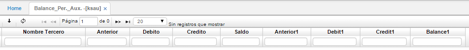

## Balance Per. Aux. - KSAU

Esta aplicación permite visualizar las cuentas auxiliares periódicamente visualizando el saldo anterior, débito y crédito de acuerdo a la afectación que tuvo la cuenta. Se puede filtrar por periodo, año, cuenta, tercero.

**Periodo:** Valor numérico que hace referencia al mes.  
**Año:** Año en el cual se va a hacer la consulta.  
**Cuenta:** Código que identifica a la cuenta.  
**Entrada:** Corresponde al plan contable de acuerdo al BCUE.  
**Projectld:** Identificación numérica del proyecto al cual pertenece la cuenta.  
**Negocio:** Identificación numérica del negocio al cual pertenece la cuenta.  
**Centro Costos:** Centro de costo a quien se carga el registro.  
**Tercero:** Número de identificación del tercero.  
**Nombre tercero:** Nombre del tercero anteriormente mencionado.  
**Anterior:** Saldo del periodo anterior.  
**Saldo:** Saldo actual.  

