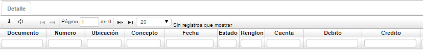
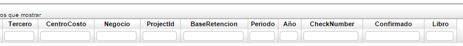

## Saldo Per. Aux. Centroc - KSPC

Esta aplicación nos permite visualizar los saldos periódicamente de los centros de costo, se puede filtrar por año, cuenta, centro de costo.

**Centro Costo:** Identificación numérica del centro de costo al cual pertenece la cuenta.  
**Año:** Año al cual se va a realizar la consulta.  
**Cuenta:** Identificación numérica y nombre de la cuenta.  
**Débito:** Valor numérico de los movimientos débitos que se realizan durante el periodo.  
**Crédito:** Valor numérico de los movimientos créditos que se realizan durante el periodo.  
**Saldo:** Valor que tendrá la cuenta después de terminar el periodo.  

